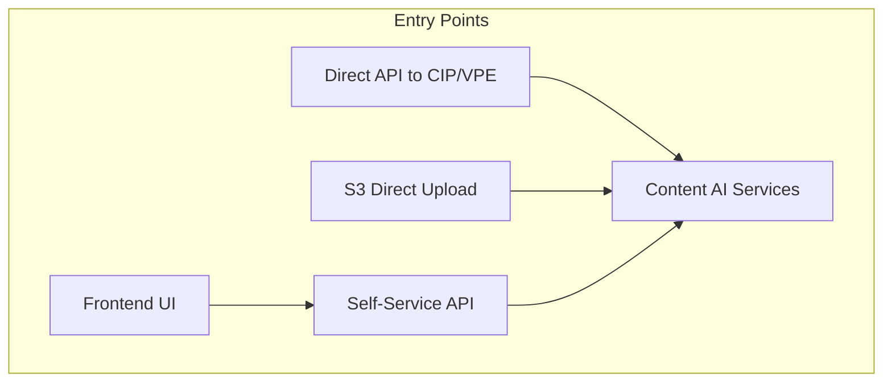

# Content AI Platform - Cost Analysis

## Table of Contents
1. [Executive Summary](#executive-summary)
2. [Platform Components & AWS Services](#platform-components--aws-services)
3. [Pricing Model Breakdown](#pricing-model-breakdown)
4. [Cost Scenarios](#cost-scenarios)
5. [Entry Point Cost Comparison](#entry-point-cost-comparison)
6. [Cost Optimization Recommendations](#cost-optimization-recommendations)

---

## Executive Summary

This document provides a comprehensive cost analysis for the Content AI Platform across different volume scenarios. The platform consists of:

- **Self-Service Imaging App** (Frontend + Orchestration)
- **Textract Imaging Service (CIP)** - Document processing with Textract, Comprehend, SageMaker
- **Video Processing Enrichment (VPE)** - Video analysis with Rekognition, Transcribe, Translate, Bedrock

### Cost Overview by Volume (Monthly Estimates - ap-southeast-2 Region)

| Volume | Documents Only | Video Only | Mixed (70% Doc / 30% Video) |
|--------|---------------|------------|----------------------------|
| 10,000 | $850 - $1,500 | $2,800 - $4,500 | $1,450 - $2,400 |
| 100,000 | $7,500 - $13,000 | $25,000 - $40,000 | $12,750 - $21,100 |
| 500,000 | $35,000 - $60,000 | $120,000 - $190,000 | $60,500 - $99,000 |
| 1,000,000 | $65,000 - $110,000 | $235,000 - $375,000 | $116,000 - $189,500 |

*Note: Ranges reflect variations in document complexity, video duration, and feature utilization.*

---

## Platform Components & AWS Services

### 1. Self-Service Imaging App (Orchestration Layer)

| Service | Purpose | Pricing Model |
|---------|---------|---------------|
| API Gateway | REST API endpoints | $3.50 per million requests + data transfer |
| Lambda | API handlers, event processors | $0.20 per 1M requests + $0.0000166667/GB-second |
| Step Functions | Job orchestration | $0.025 per 1,000 state transitions (Standard) |
| DynamoDB | Job/file metadata storage | On-demand: $1.25 per million writes, $0.25 per million reads |
| S3 | Document/video storage | $0.023/GB storage + $0.005 per 1,000 PUT requests |
| SNS/SQS | Event messaging | $0.50 per million messages |
| Cognito | Authentication | $0.0055 per MAU after 50,000 |

### 2. Textract Imaging Service (CIP)

| Service | Purpose | Pricing Model |
|---------|---------|---------------|
| **Textract** | Document OCR & extraction | See detailed pricing below |
| **Comprehend** | PII detection & NLP | $0.0001 per unit (100 chars) |
| **SageMaker** | Custom classification | Inference endpoint costs |
| **Bedrock** | AI-powered classification | $0.003/1K input + $0.015/1K output tokens (Claude 3.5 Sonnet) |

#### Textract API Pricing (per page)

| API | First 1M Pages | After 1M Pages |
|-----|----------------|----------------|
| Detect Document Text (OCR) | $0.0015 | $0.0006 |
| Analyze Document (Forms) | $0.050 | $0.040 |
| Analyze Document (Tables) | $0.015 | $0.010 |
| Analyze Document (Queries) | $0.015 | $0.015 |
| Analyze Expense | $0.010 | $0.008 |

### 3. Video Processing Enrichment (VPE)

| Service | Purpose | Pricing Model |
|---------|---------|---------------|
| **Rekognition Video** | Video analysis | $0.10 per minute analyzed |
| **Transcribe** | Speech-to-text | $0.024 per minute (standard) |
| **Translate** | Multi-language translation | $15.00 per million characters |
| **Bedrock** | Summary generation | $0.003/1K input + $0.015/1K output tokens |

#### Rekognition Video Pricing (per minute)

| Feature | Price per Minute |
|---------|------------------|
| Label Detection | $0.10 |
| Face Detection | $0.10 |
| Celebrity Recognition | $0.10 |
| Content Moderation | $0.10 |
| Text Detection | $0.10 |
| Face Search | $0.10 |

*Note: Each feature is charged separately when running multiple analyses.*

---

## Pricing Model Breakdown

### Assumptions for Cost Calculations

#### Document Processing (CIP)
- Average document: 5 pages
- Average page: 2,000 characters
- Processing includes: OCR + Forms + PII Detection
- 20% of documents require human review classification
- Classification uses Bedrock Claude 3.5 Sonnet

#### Video Processing (VPE)
- Average video duration: 5 minutes
- Features enabled: Transcription, Label Detection, Face Detection, Content Moderation
- Translation to 2 additional languages
- Summary generation with Bedrock

### Per-Unit Cost Breakdown

#### Single Document (5 pages)

| Component | Calculation | Cost |
|-----------|-------------|------|
| S3 Storage (500KB avg) | $0.023/GB | $0.00001 |
| Lambda Invocations (10 calls) | $0.20/1M + compute | $0.00015 |
| Step Functions (15 transitions) | $0.025/1K | $0.000375 |
| DynamoDB (5 writes, 10 reads) | On-demand | $0.000009 |
| **Textract OCR** (5 pages) | $0.0015/page | **$0.0075** |
| **Textract Forms** (5 pages) | $0.05/page | **$0.25** |
| **Comprehend PII** (10K chars) | $0.0001/100 chars | **$0.01** |
| Bedrock Classification (optional) | ~500 tokens | $0.009 |
| SNS/SQS Messaging | $0.50/1M | $0.000002 |
| **Total per Document** | | **$0.08 - $0.28** |

*Range depends on whether Forms analysis and Bedrock classification are enabled.*

#### Single Video (5 minutes)

| Component | Calculation | Cost |
|-----------|-------------|------|
| S3 Storage (500MB avg) | $0.023/GB | $0.0115 |
| Lambda Invocations (20 calls) | $0.20/1M + compute | $0.0005 |
| Step Functions (25 transitions) | $0.025/1K | $0.000625 |
| DynamoDB (10 writes, 20 reads) | On-demand | $0.000015 |
| **Transcribe** (5 min) | $0.024/min | **$0.12** |
| **Rekognition Labels** (5 min) | $0.10/min | **$0.50** |
| **Rekognition Faces** (5 min) | $0.10/min | **$0.50** |
| **Rekognition Moderation** (5 min) | $0.10/min | **$0.50** |
| **Translate** (15K chars x 2 langs) | $15/M chars | **$0.45** |
| **Bedrock Summary** (~2K tokens) | Claude pricing | **$0.036** |
| SNS/SQS Messaging | $0.50/1M | $0.000005 |
| **Total per Video** | | **$2.12 - $4.50** |

*Range depends on number of Rekognition features and languages for translation.*

---

## Cost Scenarios

### Scenario 1: 10,000 Items/Month

#### Documents Only (10K documents)

| Cost Category | Monthly Cost |
|---------------|--------------|
| **AI/ML Services** | |
| Textract (50K pages OCR) | $75 |
| Textract (50K pages Forms) | $2,500 |
| Comprehend PII (100M chars) | $100 |
| Bedrock Classification (2K docs) | $18 |
| **Infrastructure** | |
| Lambda (100K invocations) | $2 |
| Step Functions (150K transitions) | $3.75 |
| DynamoDB (50K writes, 100K reads) | $0.09 |
| S3 Storage (5GB) | $0.12 |
| API Gateway (20K requests) | $0.07 |
| SNS/SQS | $0.01 |
| **Total (Full Features)** | **$2,699** |
| **Total (OCR + PII Only)** | **$199** |

#### Videos Only (10K videos @ 5 min avg)

| Cost Category | Monthly Cost |
|---------------|--------------|
| **AI/ML Services** | |
| Transcribe (50K min) | $1,200 |
| Rekognition Labels (50K min) | $5,000 |
| Rekognition Faces (50K min) | $5,000 |
| Rekognition Moderation (50K min) | $5,000 |
| Translate (300M chars) | $4,500 |
| Bedrock Summaries (20M tokens) | $360 |
| **Infrastructure** | |
| Lambda (200K invocations) | $4 |
| Step Functions (250K transitions) | $6.25 |
| DynamoDB | $0.18 |
| S3 Storage (5TB) | $115 |
| **Total (Full Features)** | **$21,185** |
| **Total (Transcribe + Labels)** | **$6,325** |

#### Mixed Workload (7K docs + 3K videos)

| Cost Category | Monthly Cost |
|---------------|--------------|
| Document Processing | $1,890 (full) / $140 (basic) |
| Video Processing | $6,356 (full) / $1,898 (basic) |
| **Total Range** | **$2,038 - $8,246** |

---

### Scenario 2: 100,000 Items/Month

#### Documents Only (100K documents)

| Cost Category | Monthly Cost |
|---------------|--------------|
| **AI/ML Services** | |
| Textract (500K pages OCR) | $750 |
| Textract (500K pages Forms) | $25,000 |
| Comprehend PII (1B chars) | $1,000 |
| Bedrock Classification (20K docs) | $180 |
| **Infrastructure** | |
| Lambda (1M invocations) | $20 |
| Step Functions (1.5M transitions) | $37.50 |
| DynamoDB | $0.88 |
| S3 Storage (50GB) | $1.15 |
| API Gateway (200K requests) | $0.70 |
| **Total (Full Features)** | **$26,990** |
| **Total (OCR + PII Only)** | **$1,810** |

#### Videos Only (100K videos @ 5 min avg)

| Cost Category | Monthly Cost |
|---------------|--------------|
| **AI/ML Services** | |
| Transcribe (500K min) | $12,000 |
| Rekognition Labels (500K min) | $50,000 |
| Rekognition Faces (500K min) | $50,000 |
| Rekognition Moderation (500K min) | $50,000 |
| Translate (3B chars) | $45,000 |
| Bedrock Summaries | $3,600 |
| **Infrastructure** | |
| Lambda | $40 |
| Step Functions | $62.50 |
| DynamoDB | $1.75 |
| S3 Storage (50TB) | $1,150 |
| **Total (Full Features)** | **$211,854** |
| **Total (Transcribe + Labels)** | **$63,254** |

---

### Scenario 3: 500,000 Items/Month

#### Documents Only (500K documents)

| Cost Category | Monthly Cost |
|---------------|--------------|
| **AI/ML Services** | |
| Textract (2.5M pages OCR) | $3,150 * |
| Textract (2.5M pages Forms) | $115,000 * |
| Comprehend PII (5B chars) | $5,000 |
| Bedrock Classification (100K docs) | $900 |
| **Infrastructure** | |
| Lambda (5M invocations) | $100 |
| Step Functions (7.5M transitions) | $187.50 |
| DynamoDB | $4.38 |
| S3 Storage (250GB) | $5.75 |
| **Total (Full Features)** | **$124,347** |
| **Total (OCR + PII Only)** | **$8,447** |

*Volume discounts applied after 1M pages*

#### Videos Only (500K videos @ 5 min avg)

| Cost Category | Monthly Cost |
|---------------|--------------|
| **AI/ML Services** | |
| Transcribe (2.5M min) | $60,000 |
| Rekognition Labels (2.5M min) | $250,000 |
| Rekognition (3 features) | $750,000 |
| Translate (15B chars) | $225,000 |
| Bedrock Summaries | $18,000 |
| **Infrastructure** | ~$6,500 |
| **Total (Full Features)** | **$1,059,500** |
| **Total (Transcribe + Labels)** | **$316,500** |

---

### Scenario 4: 1,000,000 Items/Month

#### Documents Only (1M documents)

| Cost Category | Monthly Cost |
|---------------|--------------|
| **AI/ML Services** | |
| Textract (5M pages OCR) | $5,700 * |
| Textract (5M pages Forms) | $220,000 * |
| Comprehend PII (10B chars) | $10,000 |
| Bedrock Classification (200K docs) | $1,800 |
| **Infrastructure** | |
| Lambda (10M invocations) | $200 |
| Step Functions (15M transitions) | $375 |
| DynamoDB | $8.75 |
| S3 Storage (500GB) | $11.50 |
| **Total (Full Features)** | **$238,095** |
| **Total (OCR + PII Only)** | **$16,295** |

*Significant volume discounts - contact AWS for enterprise pricing*

#### Videos Only (1M videos @ 5 min avg)

| Cost Category | Monthly Cost |
|---------------|--------------|
| **AI/ML Services** | |
| Transcribe (5M min) | $120,000 |
| Rekognition Labels (5M min) | $500,000 |
| Rekognition (3 features) | $1,500,000 |
| Translate (30B chars) | $450,000 |
| Bedrock Summaries | $36,000 |
| **Infrastructure** | ~$13,000 |
| **Total (Full Features)** | **$2,119,000** |
| **Total (Transcribe + Labels)** | **$633,000** |

---

## Entry Point Cost Comparison

### Processing Entry Points

The Content AI platform supports multiple entry points for job submission:



### Cost Comparison by Entry Point

| Entry Point | Infrastructure Overhead | Per-Item Cost Impact |
|-------------|------------------------|---------------------|
| **Frontend + Self-Service API** | Full orchestration stack | +$0.0005 - $0.001 |
| **Direct API to CIP/VPE** | Minimal (API Gateway only) | Base cost |
| **S3 Direct Upload** | S3 + Lambda trigger only | -$0.0002 (no API Gateway) |

### Detailed Entry Point Analysis

#### 1. Frontend-Initiated (via Self-Service Imaging App)

```
User → React UI → API Gateway → Lambda → Step Functions → CIP/VPE → SNS → UI Update
```

**Additional Costs:**
- Cognito authentication: $0.0055/MAU
- API Gateway: $3.50/1M requests
- Step Functions orchestration: $0.025/1K transitions
- SNS notifications: $0.50/1M messages

**Best For:** Interactive workflows, job tracking, human review integration

#### 2. Self-Service API Direct Call

```
Client → API Gateway → Lambda → Step Functions → CIP/VPE → Callback
```

**Additional Costs:**
- API Gateway: $3.50/1M requests
- Step Functions: $0.025/1K transitions
- Webhook callbacks (if needed)

**Best For:** System integrations, batch submissions via API

#### 3. Direct API to CIP or VPE

```
Client → CIP/VPE API Gateway → Lambda → Processing → SNS Response
```

**Additional Costs:**
- API Gateway: $3.50/1M requests (single service)
- No Step Functions overhead

**Cost Savings:** ~$0.0004/item (no orchestration)

**Best For:** Simple processing without orchestration needs

#### 4. S3 Direct Upload (Event-Driven)

```
S3 Upload → S3 Event → Lambda → Processing → SNS/S3 Output
```

**Additional Costs:**
- S3 PUT request: $0.005/1K requests
- Lambda invocation only

**Cost Savings:** ~$0.0006/item (no API Gateway)

**Best For:** High-volume batch processing, automated pipelines

### Cost Summary by Entry Point (10K items)

| Entry Point | Documents | Videos | Mixed |
|-------------|-----------|--------|-------|
| Frontend + Orchestration | $2,710 | $21,200 | $8,260 |
| Self-Service API | $2,705 | $21,195 | $8,255 |
| Direct CIP/VPE API | $2,699 | $21,185 | $8,246 |
| S3 Direct Upload | $2,695 | $21,180 | $8,240 |

*Difference is minimal for AI/ML-heavy workloads; orchestration adds ~0.5% overhead*

---

## Cost Optimization Recommendations

### 1. Feature Selection Optimization

| Scenario | Recommendation | Potential Savings |
|----------|----------------|-------------------|
| Simple text extraction | Use Textract OCR only, skip Forms | 80-90% on Textract |
| No translation needed | Disable Translate in VPE | ~20% on video costs |
| Single language videos | Skip multi-language translation | $15/M characters saved |
| Basic video analysis | Label detection only | 75% on Rekognition |

### 2. Volume-Based Strategies

#### Textract Optimization
- Use **batch/async APIs** for better throughput
- Enable **Textract Forms** only when needed
- Consider **Textract Queries** for targeted extraction ($0.015/page)

#### Rekognition Optimization
- Analyze only required features (not all 5)
- Use **sampling** for long videos (analyze every Nth frame)
- Cache face detection results for recurring faces

#### Bedrock Optimization
- Use **Claude Haiku** ($0.00025/1K input) for simple tasks
- Implement **prompt caching** for repeated patterns
- Batch summarization requests

### 3. Infrastructure Optimization

| Service | Optimization | Impact |
|---------|--------------|--------|
| Lambda | Right-size memory (512MB vs 1GB) | 20-50% Lambda cost reduction |
| Step Functions | Use Express Workflows for short jobs | Up to 90% on state transitions |
| DynamoDB | Use provisioned capacity at scale | 20-30% at high volumes |
| S3 | Lifecycle policies for cleanup | Prevent unbounded storage growth |

### 4. Reserved Capacity & Savings Plans

| Commitment | Service | Discount |
|------------|---------|----------|
| 1-year Reserved | SageMaker Endpoints | Up to 64% |
| Savings Plans | Lambda, SageMaker | Up to 17% |
| Volume Discounts | Textract, Rekognition | Contact AWS |

### 5. Architecture Recommendations

#### For Document-Heavy Workloads (>100K/month)
1. Use S3 direct upload with event triggers
2. Implement Step Functions Express Workflows
3. Enable DynamoDB provisioned capacity
4. Consider SageMaker for custom classification (vs Textract Forms)

#### For Video-Heavy Workloads (>10K/month)
1. Optimize Rekognition feature selection
2. Use Transcribe batch processing
3. Cache translation results for common phrases
4. Consider lower-cost Bedrock models for summaries

---

## Appendix: AWS Free Tier Benefits

### First 12 Months (New Accounts)

| Service | Free Tier |
|---------|-----------|
| Lambda | 1M requests, 400K GB-seconds |
| DynamoDB | 25 GB storage, 25 RCU/WCU |
| S3 | 5 GB storage |
| Textract | 100 pages/month per API |
| Comprehend | 50K units/month |
| Transcribe | 60 minutes/month |
| Rekognition | 5K images/month, 60 min video |
| Translate | 2M characters/month |

### Always Free

| Service | Free Tier |
|---------|-----------|
| Step Functions | 4,000 state transitions/month |
| SNS | 1M publishes |
| SQS | 1M requests |

---

## Contact for Enterprise Pricing

For volumes exceeding 500K items/month, contact AWS Sales for:
- Custom pricing agreements
- Reserved capacity discounts
- Dedicated support
- Architecture review

**AWS Contact:** [aws.amazon.com/contact-us](https://aws.amazon.com/contact-us/)

---

*Last Updated: February 2026*
*Region: ap-southeast-2 (Sydney)*
*Prices subject to change - verify at [aws.amazon.com/pricing](https://aws.amazon.com/pricing/)*
