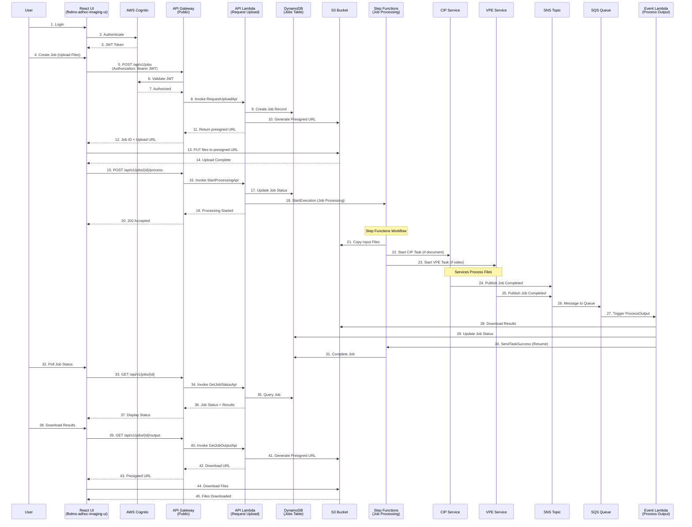
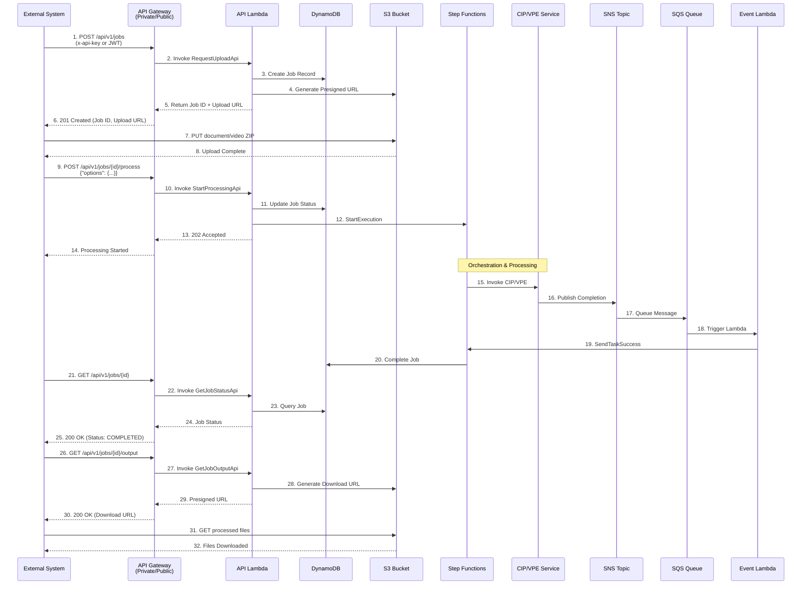
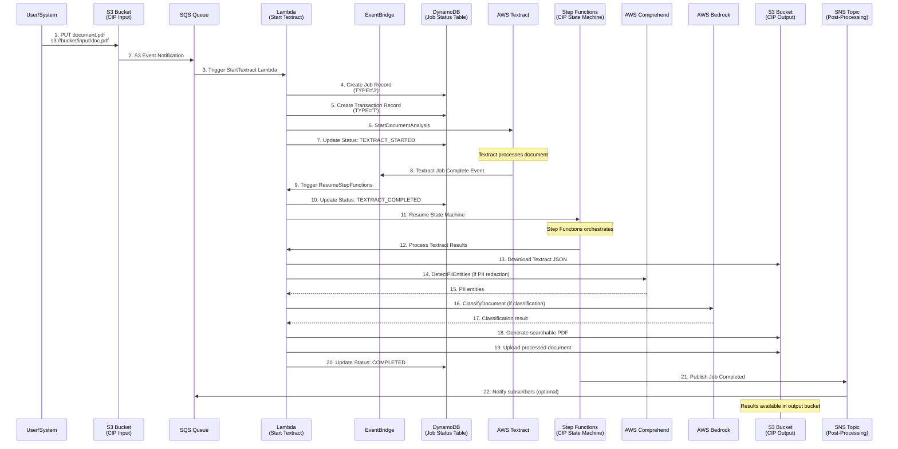
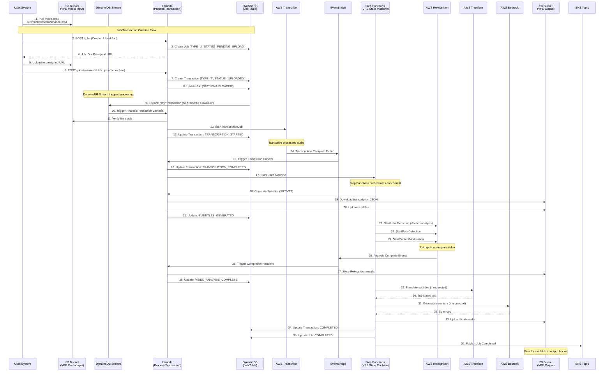
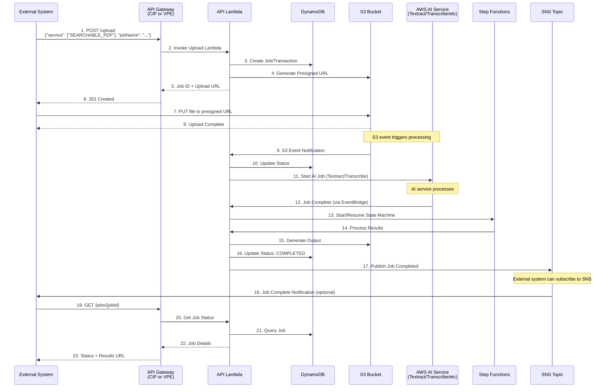
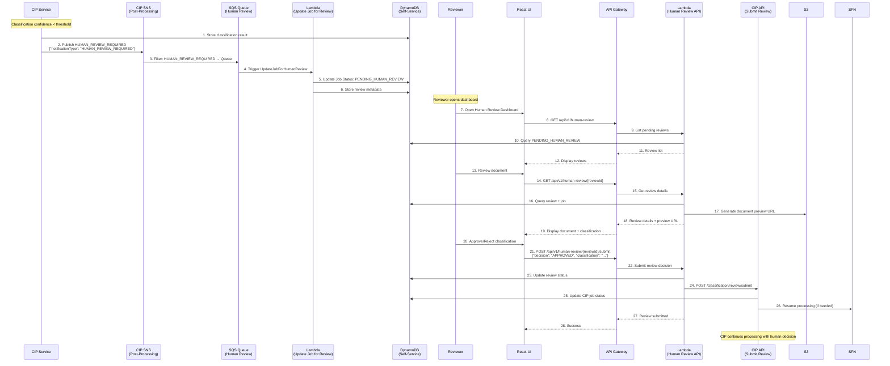
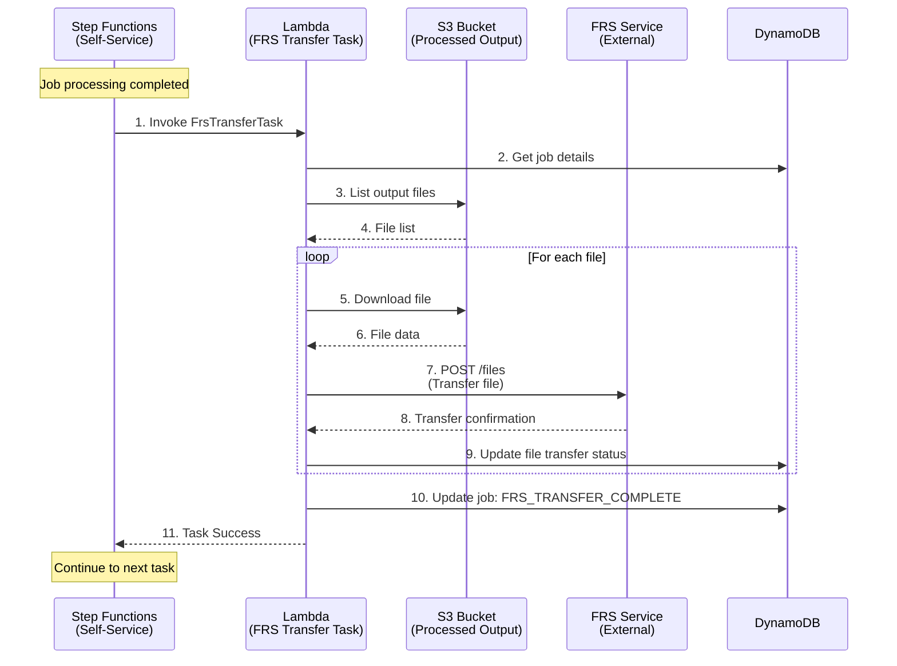
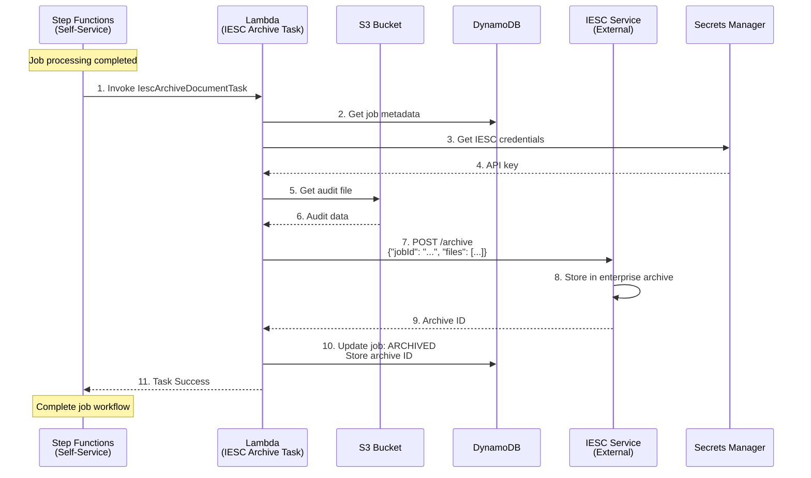
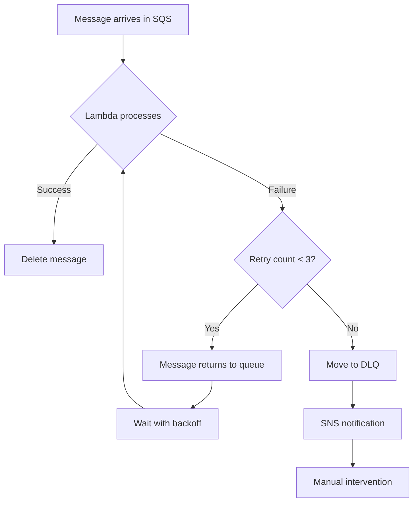
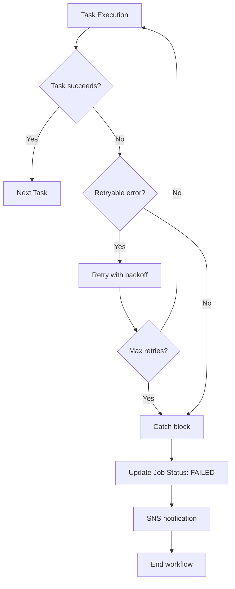

# Content AI Platform - Data Flow Diagrams

**Last Updated:** February 3, 2026

This document illustrates the data flow patterns across the Content AI Platform using Mermaid diagrams. Each flow represents a different entry point and processing path through the system.

---

## Table of Contents

1. [Frontend-Initiated Flow](#1-frontend-initiated-flow)
2. [API-Initiated Flow](#2-api-initiated-flow)
3. [Direct S3 Upload to CIP](#3-direct-s3-upload-to-cip)
4. [Direct S3 Upload to VPE](#4-direct-s3-upload-to-vpe)
5. [Direct API to CIP/VPE](#5-direct-api-to-cipvpe)
6. [Human Review Flow](#6-human-review-flow)
7. [External Integration Flows](#7-external-integration-flows)

---

## 1. Frontend-Initiated Flow

### User uploads documents/videos via React UI



### Flow Summary

| Step | Component | Action |
|------|-----------|--------|
| 1-3 | Authentication | User logs in via Cognito |
| 4-12 | Job Creation | Create job record and get presigned upload URL |
| 13-14 | File Upload | Upload files directly to S3 |
| 15-20 | Start Processing | Trigger Step Functions workflow |
| 21-30 | Processing | Step Functions orchestrates CIP/VPE processing |
| 31 | Completion | Job marked complete in DynamoDB |
| 32-37 | Status Polling | User polls for job completion |
| 38-45 | Download | User downloads processed results |

---

## 2. API-Initiated Flow

### External system calls self-service-imaging-app API directly



### Key Differences from Frontend Flow

- Uses API key or JWT authentication (no Cognito login UI)
- Typically batch/automated operations
- Supports both public and private API Gateway endpoints
- Can specify processing options in request body

---

## 3. Direct S3 Upload to CIP

### Files uploaded directly to CIP S3 bucket trigger processing



### Entry Point Characteristics

- **Trigger**: S3 PUT event
- **Authentication**: IAM role-based (no user authentication)
- **Use Case**: Batch processing, automated pipelines, ETL jobs
- **Isolation**: Processing isolated to CIP service (no orchestration layer)

---

## 4. Direct S3 Upload to VPE

### Video/audio files uploaded directly to VPE S3 bucket



### VPE Job/Transaction Model

- **Job**: Represents upload request (can contain multiple files if ZIP)
- **Transaction**: Individual media file being processed
- **Statuses**: `PENDING_UPLOAD → UPLOADED → TRANSCRIPTION_STARTED → TRANSCRIPTION_COMPLETED → SUBTITLES_GENERATED → COMPLETED`

---

## 5. Direct API to CIP/VPE

### External systems call CIP or VPE APIs directly (bypassing orchestration)



### Use Cases for Direct API Access

- **CIP Direct API**: Document processing systems that don't need VPE
- **VPE Direct API**: Video platforms that don't need document processing
- **Isolation**: Each service operates independently
- **Integration**: Services can still publish to SNS for downstream consumers

---

## 6. Human Review Flow

### Document classification requires human review



### Human Review Trigger Conditions

- Classification confidence below threshold (e.g., < 70%)
- Multiple possible classifications with similar scores
- Document type not in training set
- Manual review flag set in policy

### Review Outcomes

- **APPROVED**: Use AI classification, continue processing
- **REJECTED**: Use human classification, retrain model
- **ESCALATED**: Forward to senior reviewer

---

## 7. External Integration Flows

### 7.1 FRS (File Repository Service) Transfer



### 7.2 IESC (Integrated Enterprise System) Archive



---

## Flow Comparison Matrix

| Flow Type | Entry Point | Authentication | Orchestration | Use Case |
|-----------|-------------|----------------|---------------|----------|
| **Frontend** | React UI → API Gateway | Cognito JWT | Step Functions | End users, self-service |
| **Direct API** | External → API Gateway | API Key/JWT | Step Functions | External systems, automation |
| **S3 to CIP** | S3 PUT → CIP | IAM Role | CIP State Machine | Batch document processing |
| **S3 to VPE** | S3 PUT → VPE | IAM Role | VPE State Machine | Batch video processing |
| **Direct CIP/VPE API** | External → CIP/VPE API | API Key | Service State Machine | Direct service integration |
| **Human Review** | SNS → SQS → Lambda | N/A (Event-driven) | Review workflow | Classification review |
| **FRS Transfer** | Step Function Task | IAM Role | Part of main workflow | File repository integration |
| **IESC Archive** | Step Function Task | IAM Role + API Key | Part of main workflow | Enterprise archiving |

---

## Processing Status Progression

### Self-Service Job Statuses

```
CREATED → PENDING_UPLOAD → UPLOADED → PROCESSING →
  ├─> CIP_PROCESSING → CIP_COMPLETED
  ├─> VPE_PROCESSING → VPE_COMPLETED
  ├─> PENDING_HUMAN_REVIEW → REVIEW_COMPLETED (if applicable)
  └─> COMPLETED / FAILED
```

### CIP Transaction Statuses

```
CREATED → TEXTRACT_STARTED → TEXTRACT_COMPLETED →
  ├─> PII_DETECTION (if applicable)
  ├─> CLASSIFICATION (if applicable)
  └─> COMPLETED
```

### VPE Transaction Statuses

```
UPLOADED → TRANSCRIPTION_STARTED → TRANSCRIPTION_COMPLETED →
  SUBTITLES_GENERATED →
  ├─> VIDEO_ANALYSIS (if applicable)
  └─> COMPLETED
```

---

## Error Handling Patterns

### Retry Flow (SQS Dead Letter Queue)



### State Machine Error Handling



---

## Performance Characteristics

| Flow Type | Latency | Throughput | Cost Optimization |
|-----------|---------|------------|-------------------|
| Frontend | 2-10 min | 10-100 jobs/min | On-demand scaling |
| Direct API | 2-10 min | 100-1000 jobs/min | Batch processing |
| S3 to CIP | 1-5 min | 1000+ docs/min | Event-driven, no polling |
| S3 to VPE | 5-30 min | 100-500 videos/min | Asynchronous processing |
| Human Review | Variable | 1-10 reviews/hr | Manual process |

---

## Monitoring & Observability

### Key Metrics per Flow

- **API Latency**: API Gateway → Lambda → Response time
- **Processing Duration**: Job start → Completion time
- **Success Rate**: Completed jobs / Total jobs
- **Error Rate**: Failed jobs / Total jobs
- **Queue Depth**: Messages in SQS queues
- **DLQ Messages**: Messages in dead letter queues
- **Step Function Executions**: Running, succeeded, failed
- **AI Service Usage**: Textract pages, Transcribe minutes, Bedrock requests

### CloudWatch Log Insights Queries

Available in each component's documentation for troubleshooting specific flows.

---

## Next Steps

- Review [Component Overview](./component-overview.md) for detailed service documentation
- Examine [Integration Patterns](./integration-patterns.md) for implementation details
- See [Architecture Diagram](./architecture-diagram.drawio) for visual reference
