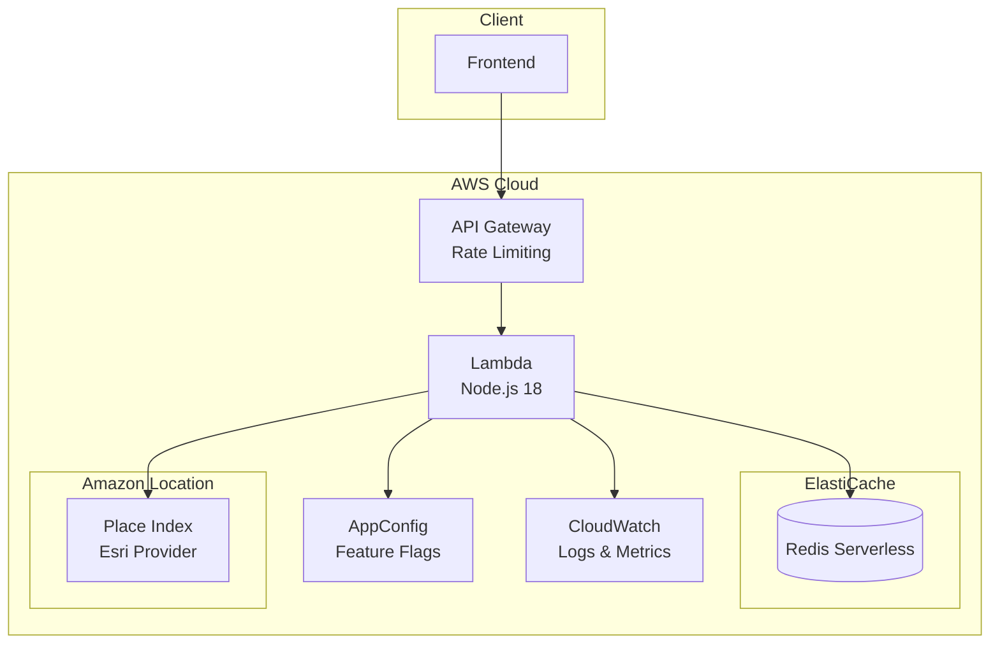
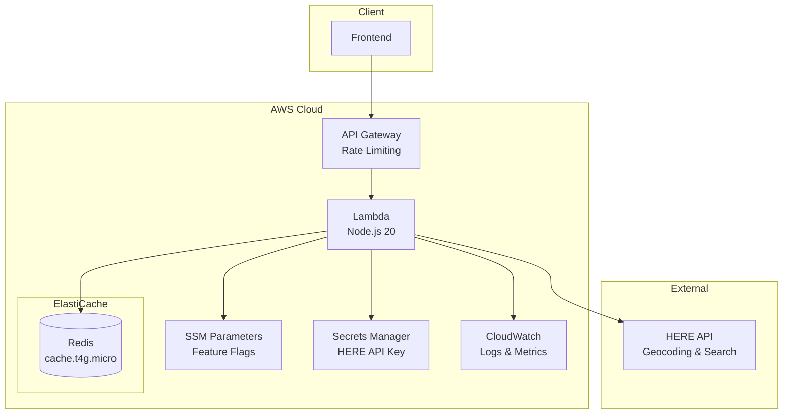

# Address Autocomplete API - Design Comparison

## Amazon Location Service vs HERE Geocoding API

This document provides a side-by-side comparison of the two technical designs for implementing the Address Autocomplete API (Jira DF-2196).

---

## Quick Comparison Matrix

| Aspect | Amazon Location Service | HERE Geocoding API |
|--------|------------------------|-------------------|
| **Data Source** | Esri (PSMA licensed) | HERE (PSMA/G-NAF licensed) |
| **AU Address Quality** | Good | Excellent |
| **AWS Integration** | Native | Via API Gateway + Lambda |
| **Setup Complexity** | Lower | Medium |
| **Cache TTL Allowed** | 24 hours | 30 days |
| **Vendor Lock-in** | AWS only | Portable |
| **Monthly Cost (100K req)** | ~$113 | ~$47 |
| **Monthly Cost (500K req)** | ~$838 | ~$160 |
| **Performance (cached)** | <100ms | <100ms |
| **Performance (uncached)** | ~150-200ms | ~100-150ms |

---

## Architecture Comparison

### Amazon Location Service Architecture



### HERE Geocoding API Architecture



---

## Detailed Comparison

### 1. Data Quality & Coverage

| Feature | Amazon Location (Esri) | HERE Geocoding |
|---------|----------------------|----------------|
| PSMA/G-NAF Data | Via Esri license | Direct license |
| Address Parsing | Good | Excellent |
| Autocomplete Relevance | Good | Better |
| Structured Components | Yes | Yes (more detailed) |
| Unit/Flat Numbers | Basic | Comprehensive |
| Rural Addresses | Good | Better |

**Winner:** HERE Geocoding (better Australian address handling)

---

### 2. Cost Analysis

#### Low Volume (100K requests/month)

| Service | Amazon Location | HERE Geocoding |
|---------|----------------|----------------|
| API Calls | $50 | $75 |
| Lambda | $2 | $2 |
| API Gateway | $0.35 | $0.35 |
| ElastiCache | $50 | $13 |
| CloudWatch | $10 | $5 |
| **Total** | **~$113** | **~$47** * |

*HERE allows 30-day caching, significantly reducing API calls at scale

#### High Volume (1M requests/month)

| Service | Amazon Location | HERE Geocoding |
|---------|----------------|----------------|
| API Calls | $500 | $200 ** |
| Lambda | $20 | $20 |
| API Gateway | $3.50 | $3.50 |
| ElastiCache | $200 | $50 |
| CloudWatch | $30 | $20 |
| **Total** | **~$754** | **~$294** |

**30-day cache significantly reduces HERE API calls

**Winner:** HERE Geocoding (30-day cache = massive cost savings at scale)

---

### 3. Performance Comparison

| Metric | Amazon Location | HERE Geocoding |
|--------|----------------|----------------|
| Cache Hit (Redis) | <50ms | <50ms |
| Cache Miss (API call) | 150-200ms | 100-150ms |
| P50 (with caching) | <100ms | <100ms |
| P99 (with caching) | <250ms | <200ms |
| Cold Start | ~200ms | ~300ms |

**Winner:** Tie (both meet <250ms requirement)

---

### 4. Implementation Complexity

| Aspect | Amazon Location | HERE Geocoding |
|--------|----------------|----------------|
| AWS Services Count | 5 | 6 |
| External Dependencies | 0 | 1 (HERE API) |
| API Key Management | IAM only | Secrets Manager |
| SDK Available | AWS SDK | REST API |
| Documentation | Good | Excellent |
| Code Complexity | Lower | Medium |

**Winner:** Amazon Location (simpler, all-AWS)

---

### 5. Caching Strategy

#### Amazon Location Service
```
Cache Key: autocomplete:v1:{query}:{locality}:{state}
TTL: 3600 seconds (1 hour) - recommended
Max TTL: 86400 seconds (24 hours) - per AWS ToS
Cache Strategy: Cache-aside with fail-open
```

#### HERE Geocoding API
```
Cache Key: addr:v1:{sha256(query+locality+state+limit)}
TTL: 2592000 seconds (30 days) - per HERE ToS
Max TTL: 30 days
Cache Strategy: Cache-aside with graceful degradation
```

**Winner:** HERE Geocoding (30x longer cache = better performance & cost)

---

### 6. Error Handling

Both designs implement similar error handling:

| Error Type | HTTP Code | Handling |
|------------|-----------|----------|
| Invalid Input | 400 | Immediate return with validation errors |
| Unauthorized | 401 | Auth middleware rejection |
| Rate Limited | 429 | Retry-After header, exponential backoff |
| Provider Error | 502 | Retry with backoff, circuit breaker |
| Timeout | 504 | Return partial/cached results |

**Winner:** Tie

---

### 7. Rate Limiting

| Layer | Amazon Location | HERE Geocoding |
|-------|----------------|----------------|
| API Gateway | 100 req/min/user | 1000 req/sec global |
| Lambda | Redis-based per-user | Redis-based per-user |
| Provider | AWS service limits | 500 req/sec to HERE |
| Burst | 50 requests | 100 requests |

**Winner:** Tie (both configurable)

---

### 8. Monitoring & Observability

| Feature | Amazon Location | HERE Geocoding |
|---------|----------------|----------------|
| Native Metrics | Yes (CloudWatch) | Custom only |
| X-Ray Tracing | Native | Manual |
| Cost Tracking | Per-service | Need tagging |
| Alerts | CloudWatch Alarms | CloudWatch Alarms |

**Winner:** Amazon Location (native AWS observability)

---

### 9. Maintenance & Operations

| Aspect | Amazon Location | HERE Geocoding |
|--------|----------------|----------------|
| API Key Rotation | N/A (IAM) | Required |
| SDK Updates | AWS SDK | Manual client |
| Service Updates | Automatic | Monitor changelog |
| SLA | 99.9% AWS | 99.5% HERE |
| Support | AWS Support | HERE Support |

**Winner:** Amazon Location (less operational overhead)

---

## Recommendation Summary

### Choose Amazon Location Service If:
- ✅ You want all-AWS, simpler architecture
- ✅ You prefer native IAM authentication
- ✅ You need better AWS observability integration
- ✅ You have lower volumes (<100K/month)
- ✅ You want to minimize external dependencies

### Choose HERE Geocoding API If:
- ✅ You need the best Australian address quality
- ✅ You have high volumes (>100K/month) - 30-day cache saves costs
- ✅ You need detailed address component parsing
- ✅ You want vendor portability (not AWS-locked)
- ✅ Cost optimization is critical

---

## Final Recommendation

For **Jira DF-2196** specifically:

| Factor | Weight | Amazon Location | HERE Geocoding |
|--------|--------|-----------------|----------------|
| AU Address Quality | 25% | 7/10 | 9/10 |
| Cost at Scale | 20% | 6/10 | 9/10 |
| Implementation Speed | 20% | 9/10 | 7/10 |
| Performance | 15% | 8/10 | 8/10 |
| Maintenance | 10% | 9/10 | 7/10 |
| PSMA Compatibility | 10% | 7/10 | 9/10 |
| **Weighted Score** | **100%** | **7.5/10** | **8.3/10** |

### 🏆 Recommended: **HERE Geocoding API**

**Rationale:**
1. Better Australian address quality (direct PSMA/G-NAF license)
2. 30-day caching = significant cost savings at scale
3. Superior structured address parsing
4. Existing requirement mentions PSMA/AusPost - HERE has this data
5. 3-day timeline is achievable with both designs

**Alternative:** If you prioritize operational simplicity and are AWS-committed, Amazon Location Service is a solid choice with slightly less address quality but easier maintenance.

---

## Files Delivered

1. **Amazon Location Service Design:**
   `/designs/amazon-location-service-design.md`

2. **HERE Geocoding API Design:**
   `/designs/here-geocoding-api-design.md`

3. **This Comparison:**
   `/designs/design-comparison.md`
