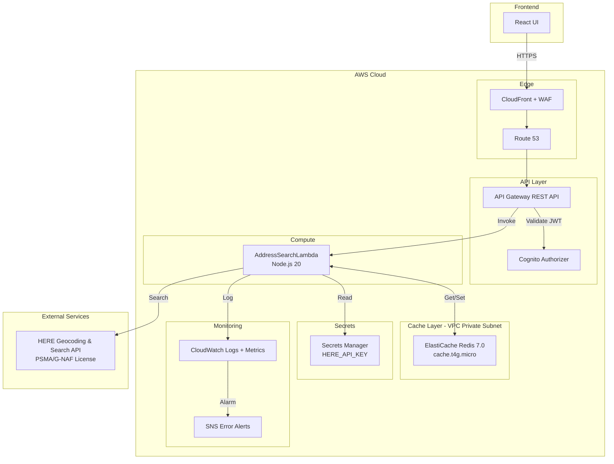
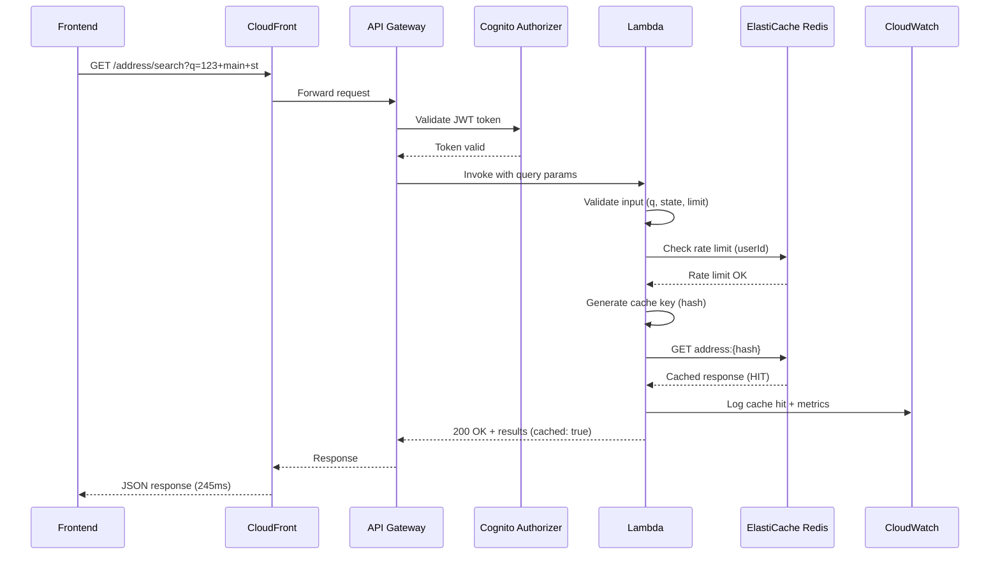
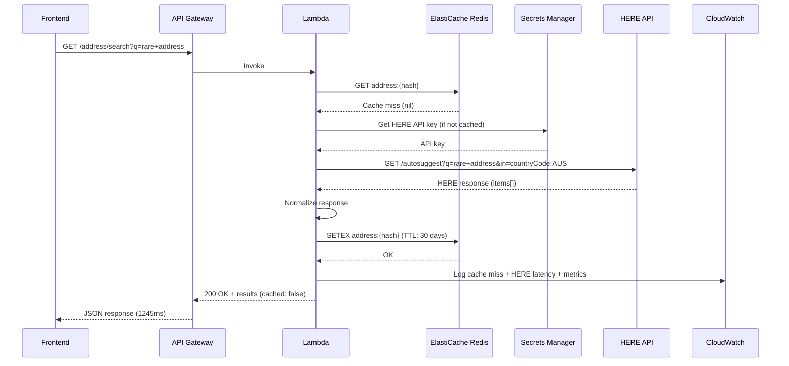
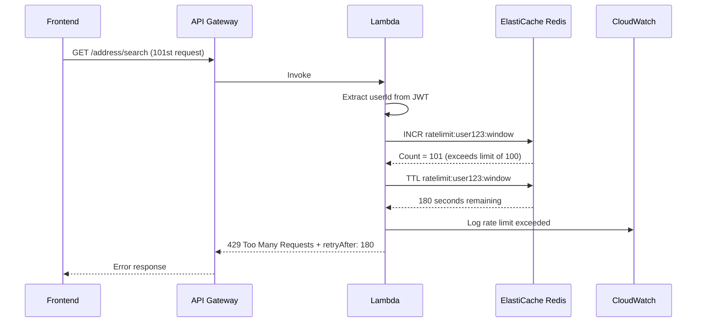
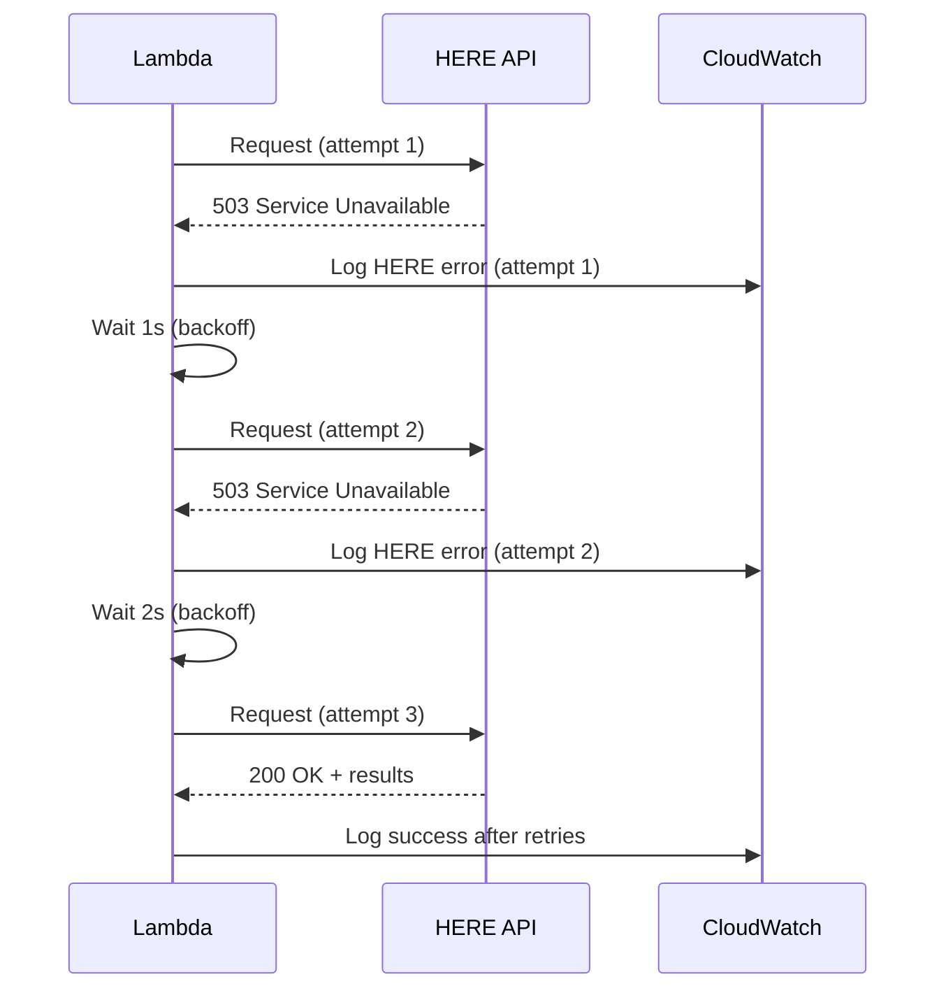

# Technical Design: Address Autocomplete API with HERE Geocoding

**Last Updated:** February 3, 2026
**Jira Ticket:** DF-2196
**Status:** Design Review
**Author:** Technical Lead

---

## Executive Summary

This design document specifies the implementation of an Address Autocomplete API that integrates with HERE Geocoding & Search API to provide fast, accurate address suggestions for Australian addresses. The solution leverages AWS serverless architecture with API Gateway, Lambda, and ElastiCache Redis for sub-250ms response times. The API normalizes HERE's response payload for frontend consumption, implements robust error handling, rate limiting, and includes comprehensive monitoring and feature flags for environment-specific deployment.

**Key Technologies:**
- AWS API Gateway (REST)
- AWS Lambda (Node.js 20)
- ElastiCache Redis (in-memory caching)
- HERE Geocoding & Search API (PSMA/G-NAF licensed)
- AWS CDK (Infrastructure as Code)
- OpenAPI 3.0 (API specification)

**Target Performance:** <250ms median response time for cached addresses

---

## Table of Contents

1. [Project Context](#project-context)
2. [Requirements & Assumptions](#requirements--assumptions)
3. [Current State Analysis](#current-state-analysis)
4. [Architecture Design](#architecture-design)
5. [HERE API Integration](#here-api-integration)
6. [API Specification](#api-specification)
7. [Caching Strategy](#caching-strategy)
8. [Rate Limiting](#rate-limiting)
9. [Error Handling](#error-handling)
10. [Lambda Implementation](#lambda-implementation)
11. [Infrastructure as Code (CDK)](#infrastructure-as-code-cdk)
12. [Data Flow Diagrams](#data-flow-diagrams)
13. [Testing Strategy](#testing-strategy)
14. [Cost Analysis](#cost-analysis)
15. [Implementation Timeline](#implementation-timeline)
16. [Deployment Strategy](#deployment-strategy)
17. [Monitoring & Observability](#monitoring--observability)
18. [Security Considerations](#security-considerations)
19. [Open Questions](#open-questions)

---

## Project Context

### Business Requirements

- **Objective:** Provide fast, accurate Australian address autocomplete functionality for user input forms
- **Target Users:** Frontend applications requiring address search (e.g., registration forms, shipping addresses)
- **Performance SLA:** <250ms median response time for cached locations
- **Data Provider:** HERE Technologies with PSMA/G-NAF license for authoritative Australian addresses
- **Timeline:** 3-day implementation sprint

### Technical Stack

| Layer | Technology | Rationale |
|-------|------------|-----------|
| API Gateway | AWS API Gateway REST | Existing platform standard, integrates with auth middleware |
| Compute | AWS Lambda (Node.js 20) | Serverless, auto-scaling, platform consistency |
| Cache | ElastiCache Redis 7.0 | In-memory caching for <250ms performance |
| External API | HERE Geocoding & Search API | PSMA/G-NAF license, authoritative AU data |
| IaC | AWS CDK (TypeScript) | Platform standard for infrastructure |
| Documentation | OpenAPI 3.0 | RESTful API specification |

### Team Context

- **Team Size:** 1 backend developer (3-day sprint)
- **Expertise:** Experienced with AWS Lambda, API Gateway, Redis, TypeScript
- **Existing Infrastructure:** Self-service imaging platform (API Gateway, Cognito, Lambda patterns established)

### Constraints

- **Performance:** <250ms median response (95th percentile <500ms)
- **Caching:** 30-day cache TTL allowed by HERE Terms of Service
- **Rate Limiting:** Protect against abuse, comply with HERE API rate limits
- **Budget:** Cost-effective solution (target <$100/month for 100K requests)
- **Compliance:** HERE API Terms of Service, data privacy regulations

---

## Requirements & Assumptions

### Functional Requirements

1. **FR-1: Address Search Endpoint**
   - Accept free-text address query
   - Support optional locality (suburb) filter
   - Support optional state filter
   - Return normalized address results

2. **FR-2: Response Normalization**
   - Transform HERE API response to frontend-friendly format
   - Standardize address components (street, suburb, state, postcode)
   - Include location coordinates (lat/long)

3. **FR-3: Pagination**
   - Support top-N results (default: 5, max: 20)
   - Allow frontend to control result count

4. **FR-4: Input Validation**
   - Validate query length (min: 3 chars, max: 200 chars)
   - Validate state codes (NSW, VIC, QLD, etc.)
   - Return 400 Bad Request for invalid input

5. **FR-5: Error Handling**
   - Log HERE API failures to CloudWatch
   - Return actionable error messages to frontend
   - Implement fallback for HERE API outages

6. **FR-6: Feature Flags**
   - Environment-specific configuration (dev, staging, prod)
   - Toggle cache enabled/disabled
   - Toggle HERE API integration (allow mock mode)

7. **FR-7: OpenAPI Documentation**
   - Publish OpenAPI 3.0 specification
   - Include request/response schemas
   - Document error codes

8. **FR-8: Authentication**
   - Integrate with existing Cognito authorizer
   - Support internal API key for service-to-service calls

### Non-Functional Requirements

1. **NFR-1: Performance**
   - Median response time <250ms (cached)
   - 95th percentile <500ms (cached)
   - 99th percentile <2000ms (uncached, HERE API call)

2. **NFR-2: Availability**
   - 99.9% uptime SLA
   - Graceful degradation on HERE API failures

3. **NFR-3: Scalability**
   - Support 1000 requests/second burst
   - Auto-scale Lambda and cache connections

4. **NFR-4: Security**
   - Encrypt HERE API key in Secrets Manager
   - TLS 1.3 for all API calls
   - Rate limiting to prevent abuse

5. **NFR-5: Observability**
   - Structured logging to CloudWatch
   - Metrics: latency, cache hit rate, error rate
   - Alarms for degraded performance

### Assumptions

- **A-1: Geographic Scope**
  - Australia-only addresses (HERE has PSMA/G-NAF license)
  - No international address support required

- **A-2: HERE API Reliability**
  - HERE API uptime: 99.9%
  - Typical response time: 200-500ms
  - Rate limits: 1000 requests/second (enterprise plan)

- **A-3: Caching**
  - 30-day cache TTL acceptable (per HERE ToS)
  - Cache hit rate: 70-80% after initial ramp-up
  - Address data changes infrequently

- **A-4: Traffic Patterns**
  - Peak usage: business hours (9am-5pm AEST)
  - Average: 50 requests/minute
  - Peak: 200 requests/minute

- **A-5: Existing Infrastructure**
  - Cognito User Pool already configured
  - API Gateway custom domain and SSL certificate exist
  - VPC with private subnets available for ElastiCache

### Non-Goals (Out of Scope)

- **NG-1:** Reverse geocoding (coordinates to address)
- **NG-2:** International address support
- **NG-3:** Address validation (delivery verification)
- **NG-4:** Batch address processing
- **NG-5:** Historical address data
- **NG-6:** Custom address parsing/formatting beyond HERE's response

---

## Current State Analysis

### Existing Platform Components

Based on the Content AI Platform architecture, the following components are already deployed:

#### 1. API Gateway Infrastructure
- **Resource:** REST API with Cognito authorizer
- **Domain:** Custom domain with Route 53 and SSL certificate
- **WAF:** Rate limiting and security rules configured
- **CORS:** Cross-origin support for frontend

#### 2. Authentication
- **Cognito User Pool:** JWT-based authentication
- **Authorizer:** Lambda authorizer validates tokens
- **User Context:** Email, groups extracted from JWT claims

#### 3. Secrets Management
- **Secrets Manager:** Centralized secret storage
- **KMS:** Encryption keys for sensitive data
- **Pattern:** Lambdas retrieve secrets at runtime

#### 4. Monitoring
- **CloudWatch Logs:** Structured logging with JSON
- **CloudWatch Metrics:** Custom metrics for APIs
- **Alarms:** SNS notifications for errors

#### 5. CDK Deployment
- **IaC Framework:** TypeScript-based AWS CDK
- **Multi-Environment:** Dev, staging, production configs
- **Stack Naming:** Consistent naming conventions

### Integration Points

The new Address Autocomplete API will integrate with:

1. **API Gateway:** Add new `/address/search` endpoint to existing API
2. **Cognito Authorizer:** Reuse existing user authentication
3. **Secrets Manager:** Store HERE API key
4. **CloudWatch:** Leverage existing logging and monitoring
5. **VPC:** Deploy ElastiCache in existing private subnets

### Gaps to Address

1. **ElastiCache:** No existing Redis cluster (new resource)
2. **HERE API Integration:** New external service dependency
3. **Cache Management:** New caching layer implementation
4. **Rate Limiting:** Enhanced rate limiting for this endpoint

---

## Architecture Design

### System Architecture



### Key Components

#### 1. API Gateway
**Purpose:** HTTP endpoint for address search requests

**Responsibilities:**
- Route `/address/search` to Lambda
- Validate JWT tokens via Cognito authorizer
- Enforce rate limiting (100 requests/5 min per user)
- Transform request/response (if needed)
- CORS handling

**Configuration:**
```yaml
Endpoint: GET /api/v1/address/search
Method: GET
Authorization: Cognito User Pool
Throttling:
  RateLimit: 1000 req/sec
  BurstLimit: 2000 req/sec
Timeout: 29 seconds (API Gateway max)
```

#### 2. Lambda Function (AddressSearchLambda)
**Purpose:** Process address search requests, interact with cache and HERE API

**Responsibilities:**
- Validate input parameters
- Check Redis cache for existing results
- Call HERE API on cache miss
- Normalize HERE response payload
- Store results in Redis (30-day TTL)
- Return formatted response
- Handle errors gracefully

**Configuration:**
```yaml
Runtime: Node.js 20
Memory: 512 MB
Timeout: 25 seconds
ReservedConcurrency: 50
Environment:
  HERE_API_URL: https://autosuggest.search.hereapi.com/v1/autosuggest
  REDIS_ENDPOINT: <ElastiCache endpoint>
  REDIS_PORT: 6379
  CACHE_TTL_SECONDS: 2592000  # 30 days
  LOG_LEVEL: info
VPC: Yes (to access ElastiCache)
```

#### 3. ElastiCache Redis
**Purpose:** In-memory cache for address search results

**Responsibilities:**
- Store normalized address results
- Expire cached entries after 30 days
- Provide <10ms read latency

**Configuration:**
```yaml
Engine: Redis 7.0
NodeType: cache.t4g.micro (1 vCPU, 0.5 GB RAM)
ClusterMode: Disabled (single node for MVP)
AutomaticFailover: Disabled (single-AZ for MVP)
SnapshotRetention: 1 day
Encryption: At rest and in transit
Subnet: Private subnet (VPC)
SecurityGroup: Allow 6379 from Lambda SG
```

**Upgrade Path (Production):**
- Multi-AZ with automatic failover (cache.t4g.small, 2 nodes)
- Cluster mode enabled for scaling (if >5GB data)

#### 4. Secrets Manager
**Purpose:** Securely store HERE API key

**Secret Name:** `address-search/here-api-key`

**Rotation:** Manual (HERE API keys don't expire)

#### 5. CloudWatch
**Purpose:** Logging, metrics, and alarms

**Log Groups:**
- `/aws/lambda/AddressSearchLambda`

**Custom Metrics:**
- `AddressSearchRequests` (count)
- `AddressSearchLatency` (milliseconds)
- `CacheHitRate` (percentage)
- `HEREAPIErrors` (count)

**Alarms:**
- Error rate >5%
- Latency p99 >2000ms
- Cache hit rate <60%
- HERE API errors >10/minute

---

## HERE API Integration

### HERE Geocoding & Search API Overview

**Service:** HERE Autosuggest API
**Endpoint:** `https://autosuggest.search.hereapi.com/v1/autosuggest`
**License:** PSMA/G-NAF (authoritative Australian address data)
**Documentation:** https://developer.here.com/documentation/geocoding-search-api/dev_guide/topics/endpoint-autosuggest-brief.html

### API Request Format

```http
GET https://autosuggest.search.hereapi.com/v1/autosuggest?q={query}&at={lat,long}&limit={limit}&in=countryCode:AUS&apiKey={key}
```

**Query Parameters:**

| Parameter | Type | Required | Description | Example |
|-----------|------|----------|-------------|---------|
| `q` | string | Yes | Search query | `123 Main St` |
| `at` | string | No | Bias location (lat,long) | `-33.8688,151.2093` (Sydney) |
| `in` | string | Yes | Country filter | `countryCode:AUS` |
| `limit` | integer | No | Max results (1-20) | `5` |
| `lang` | string | No | Language | `en` |
| `apiKey` | string | Yes | HERE API key | `{secret}` |

### Sample HERE API Response

```json
{
  "items": [
    {
      "title": "123 Main Street, Sydney NSW 2000, Australia",
      "id": "here:af:street:1234567",
      "resultType": "street",
      "address": {
        "label": "123 Main Street, Sydney NSW 2000, Australia",
        "countryCode": "AUS",
        "countryName": "Australia",
        "stateCode": "NSW",
        "state": "New South Wales",
        "county": "Sydney",
        "city": "Sydney",
        "district": "Sydney",
        "street": "Main Street",
        "postalCode": "2000",
        "houseNumber": "123"
      },
      "position": {
        "lat": -33.8688,
        "lng": 151.2093
      },
      "access": [
        {
          "lat": -33.8688,
          "lng": 151.2093
        }
      ],
      "distance": 1234,
      "highlights": {
        "title": [
          {
            "start": 0,
            "end": 3
          }
        ],
        "address": {
          "label": [
            {
              "start": 0,
              "end": 3
            }
          ]
        }
      }
    }
  ]
}
```

### Response Normalization

Transform HERE's verbose response to frontend-friendly format:

**Normalized Response Schema:**

```typescript
interface AddressSearchResponse {
  results: AddressResult[];
  metadata: {
    query: string;
    count: number;
    cached: boolean;
    responseTime: number; // milliseconds
  };
}

interface AddressResult {
  id: string;                    // HERE place ID
  formattedAddress: string;      // Full address string
  streetNumber: string | null;   // "123"
  streetName: string | null;     // "Main Street"
  suburb: string | null;         // "Sydney"
  city: string | null;           // "Sydney"
  state: string | null;          // "NSW"
  stateCode: string | null;      // "NSW"
  postcode: string | null;       // "2000"
  country: string;               // "Australia"
  countryCode: string;           // "AUS"
  location: {
    lat: number;
    lng: number;
  };
  resultType: string;            // "street" | "locality" | "address"
  distance?: number;             // Distance from bias point (meters)
}
```

**Example Normalized Response:**

```json
{
  "results": [
    {
      "id": "here:af:street:1234567",
      "formattedAddress": "123 Main Street, Sydney NSW 2000, Australia",
      "streetNumber": "123",
      "streetName": "Main Street",
      "suburb": "Sydney",
      "city": "Sydney",
      "state": "New South Wales",
      "stateCode": "NSW",
      "postcode": "2000",
      "country": "Australia",
      "countryCode": "AUS",
      "location": {
        "lat": -33.8688,
        "lng": 151.2093
      },
      "resultType": "street",
      "distance": 1234
    }
  ],
  "metadata": {
    "query": "123 main st sydney",
    "count": 1,
    "cached": false,
    "responseTime": 245
  }
}
```

### Error Handling from HERE API

| HTTP Status | Error Code | Handling Strategy |
|-------------|------------|-------------------|
| 400 | Bad Request | Return 400 to client with validation error |
| 401 | Unauthorized | Log critical error, return 503 Service Unavailable |
| 403 | Forbidden | Log critical error, return 503 Service Unavailable |
| 429 | Rate Limit | Retry with exponential backoff (3 attempts) |
| 500 | Server Error | Retry with exponential backoff (3 attempts) |
| 503 | Service Unavailable | Return cached results if available, else 503 |

---

## API Specification

### OpenAPI 3.0 Specification

```yaml
openapi: 3.0.0
info:
  title: Address Autocomplete API
  description: Australian address autocomplete using HERE Geocoding & Search API
  version: 1.0.0
  contact:
    name: Platform Team
    email: platform@example.com

servers:
  - url: https://api.example.com/api/v1
    description: Production
  - url: https://api-dev.example.com/api/v1
    description: Development

paths:
  /address/search:
    get:
      summary: Search for Australian addresses
      description: |
        Search for addresses using free-text query with optional filters.
        Results are cached for 30 days for optimal performance.
      operationId: searchAddresses
      tags:
        - Address
      security:
        - CognitoAuth: []
      parameters:
        - name: q
          in: query
          required: true
          description: Free-text address search query
          schema:
            type: string
            minLength: 3
            maxLength: 200
          example: "123 main st sydney"

        - name: locality
          in: query
          required: false
          description: Filter by suburb/locality (case-insensitive)
          schema:
            type: string
            maxLength: 100
          example: "Sydney"

        - name: state
          in: query
          required: false
          description: Filter by state code
          schema:
            type: string
            enum: [NSW, VIC, QLD, SA, WA, TAS, NT, ACT]
          example: "NSW"

        - name: limit
          in: query
          required: false
          description: Maximum number of results to return
          schema:
            type: integer
            minimum: 1
            maximum: 20
            default: 5
          example: 5

        - name: biasLat
          in: query
          required: false
          description: Latitude for location bias (must provide both biasLat and biasLng)
          schema:
            type: number
            format: double
            minimum: -44
            maximum: -10
          example: -33.8688

        - name: biasLng
          in: query
          required: false
          description: Longitude for location bias (must provide both biasLat and biasLng)
          schema:
            type: number
            format: double
            minimum: 113
            maximum: 154
          example: 151.2093

      responses:
        '200':
          description: Successful address search
          content:
            application/json:
              schema:
                $ref: '#/components/schemas/AddressSearchResponse'
              examples:
                successExample:
                  summary: Successful search with results
                  value:
                    results:
                      - id: "here:af:street:1234567"
                        formattedAddress: "123 Main Street, Sydney NSW 2000, Australia"
                        streetNumber: "123"
                        streetName: "Main Street"
                        suburb: "Sydney"
                        city: "Sydney"
                        state: "New South Wales"
                        stateCode: "NSW"
                        postcode: "2000"
                        country: "Australia"
                        countryCode: "AUS"
                        location:
                          lat: -33.8688
                          lng: 151.2093
                        resultType: "street"
                        distance: 1234
                    metadata:
                      query: "123 main st sydney"
                      count: 1
                      cached: false
                      responseTime: 245

        '400':
          description: Invalid request parameters
          content:
            application/json:
              schema:
                $ref: '#/components/schemas/ErrorResponse'
              examples:
                invalidQuery:
                  summary: Query too short
                  value:
                    error:
                      code: "INVALID_QUERY"
                      message: "Query parameter 'q' must be at least 3 characters"
                      timestamp: "2026-02-03T10:30:00Z"
                      requestId: "abc-123-def-456"

        '401':
          description: Unauthorized - invalid or missing JWT token
          content:
            application/json:
              schema:
                $ref: '#/components/schemas/ErrorResponse'

        '429':
          description: Rate limit exceeded
          content:
            application/json:
              schema:
                $ref: '#/components/schemas/ErrorResponse'
              examples:
                rateLimitExceeded:
                  summary: Too many requests
                  value:
                    error:
                      code: "RATE_LIMIT_EXCEEDED"
                      message: "Rate limit of 100 requests per 5 minutes exceeded. Please try again later."
                      timestamp: "2026-02-03T10:30:00Z"
                      requestId: "abc-123-def-456"
                      retryAfter: 120

        '500':
          description: Internal server error
          content:
            application/json:
              schema:
                $ref: '#/components/schemas/ErrorResponse'

        '503':
          description: Service unavailable (HERE API down)
          content:
            application/json:
              schema:
                $ref: '#/components/schemas/ErrorResponse'

components:
  securitySchemes:
    CognitoAuth:
      type: http
      scheme: bearer
      bearerFormat: JWT
      description: AWS Cognito JWT token

  schemas:
    AddressSearchResponse:
      type: object
      required:
        - results
        - metadata
      properties:
        results:
          type: array
          items:
            $ref: '#/components/schemas/AddressResult'
        metadata:
          $ref: '#/components/schemas/ResponseMetadata'

    AddressResult:
      type: object
      required:
        - id
        - formattedAddress
        - country
        - countryCode
        - location
        - resultType
      properties:
        id:
          type: string
          description: HERE place identifier
          example: "here:af:street:1234567"
        formattedAddress:
          type: string
          description: Full formatted address
          example: "123 Main Street, Sydney NSW 2000, Australia"
        streetNumber:
          type: string
          nullable: true
          description: Street number
          example: "123"
        streetName:
          type: string
          nullable: true
          description: Street name
          example: "Main Street"
        suburb:
          type: string
          nullable: true
          description: Suburb or locality
          example: "Sydney"
        city:
          type: string
          nullable: true
          description: City
          example: "Sydney"
        state:
          type: string
          nullable: true
          description: State full name
          example: "New South Wales"
        stateCode:
          type: string
          nullable: true
          description: State code
          example: "NSW"
        postcode:
          type: string
          nullable: true
          description: Postal code
          example: "2000"
        country:
          type: string
          description: Country name
          example: "Australia"
        countryCode:
          type: string
          description: ISO country code
          example: "AUS"
        location:
          $ref: '#/components/schemas/Location'
        resultType:
          type: string
          description: Type of result
          enum: [street, locality, address, administrativeArea]
          example: "street"
        distance:
          type: number
          description: Distance from bias point in meters
          example: 1234

    Location:
      type: object
      required:
        - lat
        - lng
      properties:
        lat:
          type: number
          format: double
          description: Latitude
          example: -33.8688
        lng:
          type: number
          format: double
          description: Longitude
          example: 151.2093

    ResponseMetadata:
      type: object
      required:
        - query
        - count
        - cached
        - responseTime
      properties:
        query:
          type: string
          description: Original search query
          example: "123 main st sydney"
        count:
          type: integer
          description: Number of results returned
          example: 5
        cached:
          type: boolean
          description: Whether results came from cache
          example: false
        responseTime:
          type: integer
          description: Response time in milliseconds
          example: 245

    ErrorResponse:
      type: object
      required:
        - error
      properties:
        error:
          type: object
          required:
            - code
            - message
            - timestamp
            - requestId
          properties:
            code:
              type: string
              description: Machine-readable error code
              example: "INVALID_QUERY"
            message:
              type: string
              description: Human-readable error message
              example: "Query parameter 'q' must be at least 3 characters"
            timestamp:
              type: string
              format: date-time
              description: Error timestamp
              example: "2026-02-03T10:30:00Z"
            requestId:
              type: string
              description: Request ID for debugging
              example: "abc-123-def-456"
            retryAfter:
              type: integer
              description: Seconds to wait before retrying (for rate limit errors)
              example: 120
```

---

## Caching Strategy

### Cache Key Design

**Pattern:** `address:{hash(query+filters)}`

**Rationale:**
- Deterministic: Same query always produces same key
- Collision-resistant: SHA-256 hash ensures uniqueness
- Compact: Fixed-length key regardless of query length

**Implementation:**

```typescript
function generateCacheKey(
  query: string,
  locality?: string,
  state?: string,
  limit?: number
): string {
  const normalizedQuery = query.toLowerCase().trim();
  const normalizedLocality = locality?.toLowerCase().trim() || '';
  const normalizedState = state?.toUpperCase() || '';

  const data = `${normalizedQuery}|${normalizedLocality}|${normalizedState}|${limit || 5}`;
  const hash = crypto.createHash('sha256').update(data).digest('hex');

  return `address:${hash}`;
}
```

**Example:**
- Query: `"123 Main St"`
- Locality: `"Sydney"`
- State: `"NSW"`
- Limit: `5`
- Key: `address:a1b2c3d4e5f6...`

### Cache Value Format

Store normalized response as JSON string:

```json
{
  "results": [...],
  "metadata": {
    "query": "123 main st sydney",
    "count": 5,
    "responseTime": 245
  },
  "cachedAt": "2026-02-03T10:30:00Z"
}
```

### TTL Strategy

**TTL:** 30 days (2,592,000 seconds)

**Rationale:**
- HERE ToS allows caching up to 30 days
- Address data is relatively stable
- Balances freshness vs performance

**Redis Command:**

```typescript
await redis.setex(cacheKey, 2592000, JSON.stringify(responseData));
```

### Cache Invalidation

**Triggers:**
- Automatic: Redis TTL expiration (30 days)
- Manual: Admin API to purge specific keys (future enhancement)

**No Proactive Invalidation:**
- Address changes are infrequent
- 30-day TTL acceptable for data freshness

### Cache Miss Handling

```typescript
async function getAddressResults(params: SearchParams): Promise<AddressSearchResponse> {
  const cacheKey = generateCacheKey(params.query, params.locality, params.state, params.limit);
  const startTime = Date.now();

  // Try cache first
  const cachedData = await redis.get(cacheKey);
  if (cachedData) {
    const response = JSON.parse(cachedData);
    response.metadata.cached = true;
    response.metadata.responseTime = Date.now() - startTime;
    logger.info('Cache hit', { cacheKey, responseTime: response.metadata.responseTime });
    return response;
  }

  // Cache miss - call HERE API
  logger.info('Cache miss', { cacheKey });
  const hereResponse = await callHEREAPI(params);
  const normalized = normalizeHEREResponse(hereResponse, params.query);

  // Store in cache
  normalized.metadata.cached = false;
  normalized.metadata.responseTime = Date.now() - startTime;
  await redis.setex(cacheKey, 2592000, JSON.stringify(normalized));

  return normalized;
}
```

### Cache Performance Targets

| Metric | Target |
|--------|--------|
| Cache hit rate | >70% after ramp-up |
| Cache read latency | <10ms (p99) |
| Cache write latency | <20ms (p99) |
| Memory usage | <500 MB (MVP) |

### Monitoring Cache Health

**CloudWatch Metrics:**

```typescript
// Cache hit rate
const hitRate = (cacheHits / totalRequests) * 100;
await cloudWatch.putMetricData({
  Namespace: 'AddressSearch',
  MetricData: [{
    MetricName: 'CacheHitRate',
    Value: hitRate,
    Unit: 'Percent'
  }]
});

// Cache latency
await cloudWatch.putMetricData({
  Namespace: 'AddressSearch',
  MetricData: [{
    MetricName: 'CacheReadLatency',
    Value: cacheReadTime,
    Unit: 'Milliseconds'
  }]
});
```

**Alarm:**
- Cache hit rate <60% (sustained) → Investigate query patterns
- Cache read latency >50ms (p99) → ElastiCache node upgrade

---

## Rate Limiting

### Multi-Layer Rate Limiting

#### Layer 1: API Gateway Throttling

**Purpose:** Protect against DDoS and global rate limit

**Configuration:**

```typescript
const api = new RestApi(this, 'AddressSearchAPI', {
  defaultMethodOptions: {
    throttling: {
      rateLimit: 1000,      // 1000 requests/second
      burstLimit: 2000      // 2000 burst capacity
    }
  }
});
```

**Behavior:**
- Exceeding rate limit returns `429 Too Many Requests`
- Client receives `X-RateLimit-Limit` and `X-RateLimit-Remaining` headers

#### Layer 2: Per-User Rate Limiting (Redis)

**Purpose:** Prevent individual users from monopolizing resources

**Configuration:**
- **Limit:** 100 requests per 5 minutes per user
- **Storage:** Redis with TTL
- **Key Pattern:** `ratelimit:{userId}:{window}`

**Implementation:**

```typescript
async function checkRateLimit(userId: string): Promise<{ allowed: boolean; retryAfter?: number }> {
  const windowSize = 300; // 5 minutes in seconds
  const maxRequests = 100;
  const currentWindow = Math.floor(Date.now() / 1000 / windowSize);
  const key = `ratelimit:${userId}:${currentWindow}`;

  // Increment counter
  const current = await redis.incr(key);

  if (current === 1) {
    // First request in window - set TTL
    await redis.expire(key, windowSize);
  }

  if (current > maxRequests) {
    const ttl = await redis.ttl(key);
    return { allowed: false, retryAfter: ttl };
  }

  return { allowed: true };
}
```

**Error Response:**

```json
{
  "error": {
    "code": "RATE_LIMIT_EXCEEDED",
    "message": "Rate limit of 100 requests per 5 minutes exceeded. Please try again later.",
    "timestamp": "2026-02-03T10:30:00Z",
    "requestId": "abc-123-def-456",
    "retryAfter": 120
  }
}
```

#### Layer 3: HERE API Rate Limiting

**Purpose:** Respect HERE's API limits and minimize costs

**Configuration:**
- **HERE Limit:** 1000 requests/second (enterprise plan)
- **Our Limit:** 500 requests/second (50% buffer)
- **Strategy:** Token bucket algorithm

**Implementation:**

```typescript
class HEREAPIRateLimiter {
  private tokens: number = 500;
  private maxTokens: number = 500;
  private refillRate: number = 500; // tokens per second
  private lastRefill: number = Date.now();

  async acquire(): Promise<void> {
    await this.refill();

    if (this.tokens < 1) {
      const waitTime = (1 - this.tokens) / this.refillRate * 1000;
      await sleep(waitTime);
      await this.refill();
    }

    this.tokens -= 1;
  }

  private async refill(): Promise<void> {
    const now = Date.now();
    const elapsed = (now - this.lastRefill) / 1000;
    this.tokens = Math.min(this.maxTokens, this.tokens + elapsed * this.refillRate);
    this.lastRefill = now;
  }
}
```

### Rate Limit Headers

Include rate limit information in response headers:

```http
X-RateLimit-Limit: 100
X-RateLimit-Remaining: 87
X-RateLimit-Reset: 1675427400
```

---

## Error Handling

### Error Classification

| Category | HTTP Status | Log Level | User Message | Action |
|----------|-------------|-----------|--------------|--------|
| **Validation** | 400 | INFO | Specific validation error | Fix request |
| **Authentication** | 401 | WARN | "Unauthorized" | Re-authenticate |
| **Rate Limit** | 429 | WARN | "Rate limit exceeded" | Wait and retry |
| **HERE API Error** | 500/503 | ERROR | "Service temporarily unavailable" | Retry later |
| **Cache Error** | 200 (degrade) | ERROR | (none - fallback to HERE) | Continue |
| **Unexpected** | 500 | ERROR | "An error occurred" | Contact support |

### Error Response Schema

```typescript
interface ErrorResponse {
  error: {
    code: string;              // Machine-readable error code
    message: string;           // Human-readable message
    timestamp: string;         // ISO 8601 timestamp
    requestId: string;         // For debugging
    retryAfter?: number;       // Seconds (for 429)
    details?: object;          // Additional context (dev only)
  };
}
```

### Error Codes

| Code | HTTP Status | Description |
|------|-------------|-------------|
| `INVALID_QUERY` | 400 | Query parameter invalid (too short, too long, etc.) |
| `INVALID_STATE` | 400 | State code not valid (must be NSW, VIC, etc.) |
| `INVALID_LIMIT` | 400 | Limit outside range 1-20 |
| `INVALID_COORDINATES` | 400 | Bias coordinates invalid or incomplete |
| `UNAUTHORIZED` | 401 | Missing or invalid JWT token |
| `RATE_LIMIT_EXCEEDED` | 429 | User rate limit exceeded |
| `HERE_API_ERROR` | 500 | HERE API returned error |
| `HERE_API_UNAVAILABLE` | 503 | HERE API is down |
| `CACHE_ERROR` | 500 | Redis cache error (degraded to HERE API) |
| `INTERNAL_ERROR` | 500 | Unexpected error |

### Error Handling Flow

```typescript
async function handler(event: APIGatewayProxyEvent): Promise<APIGatewayProxyResult> {
  const requestId = event.requestContext.requestId;
  const startTime = Date.now();

  try {
    // 1. Validate input
    const params = validateInput(event.queryStringParameters);

    // 2. Check rate limit
    const userId = event.requestContext.authorizer.claims.sub;
    const rateLimitCheck = await checkRateLimit(userId);
    if (!rateLimitCheck.allowed) {
      return errorResponse(429, 'RATE_LIMIT_EXCEEDED',
        'Rate limit exceeded. Please try again later.',
        requestId, rateLimitCheck.retryAfter);
    }

    // 3. Search addresses (with cache)
    const results = await getAddressResults(params);

    // 4. Return success
    return successResponse(200, results, requestId);

  } catch (error) {
    return handleError(error, requestId);
  } finally {
    // Log metrics
    const duration = Date.now() - startTime;
    logger.info('Request completed', { requestId, duration });
  }
}

function handleError(error: any, requestId: string): APIGatewayProxyResult {
  if (error instanceof ValidationError) {
    logger.info('Validation error', { error: error.message, requestId });
    return errorResponse(400, 'INVALID_QUERY', error.message, requestId);
  }

  if (error instanceof HEREAPIError) {
    logger.error('HERE API error', { error: error.message, requestId, status: error.status });

    if (error.status === 429) {
      // HERE rate limit - retry with backoff
      return errorResponse(503, 'HERE_API_UNAVAILABLE',
        'Address search service temporarily unavailable', requestId);
    }

    return errorResponse(500, 'HERE_API_ERROR',
      'Address search service error', requestId);
  }

  if (error instanceof CacheError) {
    logger.error('Cache error - degrading to HERE API', { error: error.message, requestId });
    // Don't return error - fallback to HERE API without cache
    // (handled in getAddressResults function)
  }

  // Unexpected error
  logger.error('Unexpected error', {
    error: error.message,
    stack: error.stack,
    requestId
  });

  return errorResponse(500, 'INTERNAL_ERROR',
    'An unexpected error occurred', requestId);
}
```

### Logging Strategy

**Structured Logging:**

```typescript
const logger = {
  info: (message: string, context: object) => {
    console.log(JSON.stringify({
      level: 'INFO',
      message,
      timestamp: new Date().toISOString(),
      ...context
    }));
  },

  error: (message: string, context: object) => {
    console.error(JSON.stringify({
      level: 'ERROR',
      message,
      timestamp: new Date().toISOString(),
      ...context
    }));
  }
};
```

**Example Log Entry:**

```json
{
  "level": "ERROR",
  "message": "HERE API error",
  "timestamp": "2026-02-03T10:30:00Z",
  "requestId": "abc-123",
  "error": "Request timeout",
  "hereStatus": 503,
  "retryAttempt": 2
}
```

### Retry Strategy for HERE API

```typescript
async function callHEREAPIWithRetry(params: SearchParams, maxRetries = 3): Promise<HEREResponse> {
  for (let attempt = 1; attempt <= maxRetries; attempt++) {
    try {
      return await callHEREAPI(params);
    } catch (error) {
      const shouldRetry = error.status === 429 || error.status >= 500;
      const isLastAttempt = attempt === maxRetries;

      if (!shouldRetry || isLastAttempt) {
        throw error;
      }

      // Exponential backoff: 1s, 2s, 4s
      const backoffMs = Math.pow(2, attempt - 1) * 1000;
      logger.warn('HERE API error - retrying', { attempt, backoffMs, error: error.message });
      await sleep(backoffMs);
    }
  }
}
```

---

## Lambda Implementation

### Project Structure

```
address-search-lambda/
├── src/
│   ├── index.ts                 # Lambda handler entry point
│   ├── validator.ts             # Input validation
│   ├── cache.ts                 # Redis cache client
│   ├── here-api.ts              # HERE API client
│   ├── normalizer.ts            # Response normalization
│   ├── rate-limiter.ts          # Rate limiting logic
│   ├── errors.ts                # Custom error classes
│   └── types.ts                 # TypeScript interfaces
├── tests/
│   ├── unit/
│   │   ├── validator.test.ts
│   │   ├── normalizer.test.ts
│   │   └── cache.test.ts
│   └── integration/
│       └── handler.test.ts
├── package.json
├── tsconfig.json
└── README.md
```

### Core Implementation Files

#### 1. `src/index.ts` - Lambda Handler

```typescript
import { APIGatewayProxyEvent, APIGatewayProxyResult } from 'aws-lambda';
import { validateInput } from './validator';
import { checkRateLimit } from './rate-limiter';
import { getAddressResults } from './cache';
import { handleError, successResponse } from './responses';
import { logger } from './logger';

export async function handler(
  event: APIGatewayProxyEvent
): Promise<APIGatewayProxyResult> {
  const requestId = event.requestContext.requestId;
  const startTime = Date.now();

  logger.setContext({ requestId });

  try {
    // 1. Validate input
    const params = validateInput(event.queryStringParameters || {});
    logger.info('Input validated', { params });

    // 2. Check rate limit
    const userId = event.requestContext.authorizer?.claims?.sub || 'anonymous';
    const rateLimitCheck = await checkRateLimit(userId);

    if (!rateLimitCheck.allowed) {
      logger.warn('Rate limit exceeded', { userId });
      return errorResponse(
        429,
        'RATE_LIMIT_EXCEEDED',
        'Rate limit of 100 requests per 5 minutes exceeded',
        requestId,
        rateLimitCheck.retryAfter
      );
    }

    // 3. Search addresses (cache + HERE API)
    const results = await getAddressResults(params);

    // 4. Log metrics
    const duration = Date.now() - startTime;
    logger.info('Request successful', {
      duration,
      cached: results.metadata.cached,
      resultCount: results.metadata.count
    });

    // 5. Return success response
    return successResponse(200, results, requestId);

  } catch (error) {
    const duration = Date.now() - startTime;
    logger.error('Request failed', { duration, error });
    return handleError(error, requestId);
  }
}
```

#### 2. `src/validator.ts` - Input Validation

```typescript
import { ValidationError } from './errors';

export interface SearchParams {
  query: string;
  locality?: string;
  state?: string;
  limit: number;
  biasLat?: number;
  biasLng?: number;
}

const VALID_STATES = ['NSW', 'VIC', 'QLD', 'SA', 'WA', 'TAS', 'NT', 'ACT'];

export function validateInput(params: Record<string, string | undefined>): SearchParams {
  // Validate query
  const query = params.q?.trim();
  if (!query) {
    throw new ValidationError('Query parameter "q" is required');
  }
  if (query.length < 3) {
    throw new ValidationError('Query must be at least 3 characters');
  }
  if (query.length > 200) {
    throw new ValidationError('Query must not exceed 200 characters');
  }

  // Validate state (optional)
  const state = params.state?.toUpperCase();
  if (state && !VALID_STATES.includes(state)) {
    throw new ValidationError(
      `Invalid state code. Must be one of: ${VALID_STATES.join(', ')}`
    );
  }

  // Validate locality (optional)
  const locality = params.locality?.trim();
  if (locality && locality.length > 100) {
    throw new ValidationError('Locality must not exceed 100 characters');
  }

  // Validate limit (optional)
  const limit = params.limit ? parseInt(params.limit, 10) : 5;
  if (isNaN(limit) || limit < 1 || limit > 20) {
    throw new ValidationError('Limit must be between 1 and 20');
  }

  // Validate bias coordinates (optional, but must be both or neither)
  let biasLat: number | undefined;
  let biasLng: number | undefined;

  if (params.biasLat || params.biasLng) {
    if (!params.biasLat || !params.biasLng) {
      throw new ValidationError('Both biasLat and biasLng must be provided together');
    }

    biasLat = parseFloat(params.biasLat);
    biasLng = parseFloat(params.biasLng);

    if (isNaN(biasLat) || isNaN(biasLng)) {
      throw new ValidationError('Bias coordinates must be valid numbers');
    }

    // Validate Australian coordinate ranges
    if (biasLat < -44 || biasLat > -10) {
      throw new ValidationError('Latitude must be between -44 and -10 (Australia)');
    }
    if (biasLng < 113 || biasLng > 154) {
      throw new ValidationError('Longitude must be between 113 and 154 (Australia)');
    }
  }

  return {
    query,
    locality,
    state,
    limit,
    biasLat,
    biasLng
  };
}
```

#### 3. `src/cache.ts` - Redis Cache Client

```typescript
import Redis from 'ioredis';
import crypto from 'crypto';
import { SearchParams } from './validator';
import { AddressSearchResponse } from './types';
import { callHEREAPIWithRetry } from './here-api';
import { normalizeHEREResponse } from './normalizer';
import { logger } from './logger';
import { CacheError } from './errors';

const CACHE_TTL = 30 * 24 * 60 * 60; // 30 days in seconds

// Singleton Redis client
let redisClient: Redis | null = null;

function getRedisClient(): Redis {
  if (!redisClient) {
    redisClient = new Redis({
      host: process.env.REDIS_ENDPOINT!,
      port: parseInt(process.env.REDIS_PORT || '6379', 10),
      connectTimeout: 5000,
      maxRetriesPerRequest: 3,
      retryStrategy: (times) => {
        const delay = Math.min(times * 50, 2000);
        return delay;
      },
      tls: process.env.REDIS_TLS === 'true' ? {} : undefined
    });

    redisClient.on('error', (err) => {
      logger.error('Redis client error', { error: err.message });
    });
  }

  return redisClient;
}

function generateCacheKey(params: SearchParams): string {
  const normalizedQuery = params.query.toLowerCase().trim();
  const normalizedLocality = params.locality?.toLowerCase().trim() || '';
  const normalizedState = params.state?.toUpperCase() || '';
  const biasCoords = params.biasLat && params.biasLng
    ? `${params.biasLat.toFixed(4)},${params.biasLng.toFixed(4)}`
    : '';

  const data = `${normalizedQuery}|${normalizedLocality}|${normalizedState}|${params.limit}|${biasCoords}`;
  const hash = crypto.createHash('sha256').update(data).digest('hex');

  return `address:${hash}`;
}

export async function getAddressResults(
  params: SearchParams
): Promise<AddressSearchResponse> {
  const cacheKey = generateCacheKey(params);
  const startTime = Date.now();

  // Try cache first
  try {
    const redis = getRedisClient();
    const cachedData = await redis.get(cacheKey);

    if (cachedData) {
      const response: AddressSearchResponse = JSON.parse(cachedData);
      response.metadata.cached = true;
      response.metadata.responseTime = Date.now() - startTime;

      logger.info('Cache hit', { cacheKey, responseTime: response.metadata.responseTime });
      return response;
    }

    logger.info('Cache miss', { cacheKey });

  } catch (error) {
    // Cache error - degrade gracefully
    logger.error('Cache read error - degrading to HERE API', {
      error: error.message,
      cacheKey
    });
  }

  // Cache miss or error - call HERE API
  const hereResponse = await callHEREAPIWithRetry(params);
  const normalized = normalizeHEREResponse(hereResponse, params.query);

  normalized.metadata.cached = false;
  normalized.metadata.responseTime = Date.now() - startTime;

  // Store in cache (best effort)
  try {
    const redis = getRedisClient();
    await redis.setex(cacheKey, CACHE_TTL, JSON.stringify(normalized));
    logger.info('Cached response', { cacheKey });
  } catch (error) {
    logger.error('Cache write error', { error: error.message, cacheKey });
    // Don't fail request due to cache write error
  }

  return normalized;
}

// Graceful shutdown
export async function closeRedis(): Promise<void> {
  if (redisClient) {
    await redisClient.quit();
    redisClient = null;
  }
}
```

#### 4. `src/here-api.ts` - HERE API Client

```typescript
import axios, { AxiosError } from 'axios';
import { SecretsManagerClient, GetSecretValueCommand } from '@aws-sdk/client-secrets-manager';
import { SearchParams } from './validator';
import { HEREAPIError } from './errors';
import { logger } from './logger';

const HERE_API_URL = process.env.HERE_API_URL || 'https://autosuggest.search.hereapi.com/v1/autosuggest';
const SECRET_NAME = process.env.HERE_API_KEY_SECRET || 'address-search/here-api-key';

let cachedApiKey: string | null = null;

async function getHEREAPIKey(): Promise<string> {
  if (cachedApiKey) {
    return cachedApiKey;
  }

  const client = new SecretsManagerClient({});
  const command = new GetSecretValueCommand({ SecretId: SECRET_NAME });

  try {
    const response = await client.send(command);
    cachedApiKey = response.SecretString || '';
    return cachedApiKey;
  } catch (error) {
    logger.error('Failed to retrieve HERE API key', { error });
    throw new Error('Failed to retrieve API key from Secrets Manager');
  }
}

export async function callHEREAPI(params: SearchParams): Promise<any> {
  const apiKey = await getHEREAPIKey();

  const queryParams: Record<string, string> = {
    q: params.query,
    in: 'countryCode:AUS',
    limit: params.limit.toString(),
    lang: 'en',
    apiKey
  };

  // Add optional filters
  if (params.biasLat && params.biasLng) {
    queryParams.at = `${params.biasLat},${params.biasLng}`;
  }

  // Note: locality and state filters are applied post-response in normalizer
  // HERE API doesn't have direct locality/state filter params

  try {
    const response = await axios.get(HERE_API_URL, {
      params: queryParams,
      timeout: 20000, // 20 second timeout
      headers: {
        'User-Agent': 'AddressSearchAPI/1.0'
      }
    });

    logger.info('HERE API success', {
      status: response.status,
      resultCount: response.data.items?.length || 0
    });

    return response.data;

  } catch (error) {
    if (axios.isAxiosError(error)) {
      const axiosError = error as AxiosError;
      const status = axiosError.response?.status || 500;
      const message = axiosError.message;

      logger.error('HERE API error', {
        status,
        message,
        responseData: axiosError.response?.data
      });

      throw new HEREAPIError(status, message);
    }

    throw error;
  }
}

export async function callHEREAPIWithRetry(
  params: SearchParams,
  maxRetries = 3
): Promise<any> {
  for (let attempt = 1; attempt <= maxRetries; attempt++) {
    try {
      return await callHEREAPI(params);
    } catch (error) {
      if (!(error instanceof HEREAPIError)) {
        throw error;
      }

      const shouldRetry = error.status === 429 || error.status >= 500;
      const isLastAttempt = attempt === maxRetries;

      if (!shouldRetry || isLastAttempt) {
        throw error;
      }

      // Exponential backoff
      const backoffMs = Math.pow(2, attempt - 1) * 1000;
      logger.warn('HERE API error - retrying', {
        attempt,
        backoffMs,
        error: error.message,
        status: error.status
      });

      await new Promise(resolve => setTimeout(resolve, backoffMs));
    }
  }

  throw new Error('Max retries exceeded');
}
```

#### 5. `src/normalizer.ts` - Response Normalization

```typescript
import { AddressSearchResponse, AddressResult } from './types';
import { SearchParams } from './validator';

export function normalizeHEREResponse(
  hereResponse: any,
  query: string,
  filters?: { locality?: string; state?: string }
): AddressSearchResponse {
  const items = hereResponse.items || [];

  // Filter by locality/state if provided
  let filteredItems = items;
  if (filters?.locality) {
    const localityLower = filters.locality.toLowerCase();
    filteredItems = filteredItems.filter((item: any) =>
      item.address?.city?.toLowerCase().includes(localityLower) ||
      item.address?.district?.toLowerCase().includes(localityLower)
    );
  }

  if (filters?.state) {
    const stateUpper = filters.state.toUpperCase();
    filteredItems = filteredItems.filter((item: any) =>
      item.address?.stateCode === stateUpper
    );
  }

  const results: AddressResult[] = filteredItems.map((item: any) => ({
    id: item.id,
    formattedAddress: item.title || item.address?.label || '',
    streetNumber: item.address?.houseNumber || null,
    streetName: item.address?.street || null,
    suburb: item.address?.city || item.address?.district || null,
    city: item.address?.city || null,
    state: item.address?.state || null,
    stateCode: item.address?.stateCode || null,
    postcode: item.address?.postalCode || null,
    country: item.address?.countryName || 'Australia',
    countryCode: item.address?.countryCode || 'AUS',
    location: {
      lat: item.position?.lat || 0,
      lng: item.position?.lng || 0
    },
    resultType: item.resultType || 'unknown',
    distance: item.distance
  }));

  return {
    results,
    metadata: {
      query,
      count: results.length,
      cached: false, // Set by cache layer
      responseTime: 0 // Set by handler
    }
  };
}
```

#### 6. `src/types.ts` - TypeScript Interfaces

```typescript
export interface AddressSearchResponse {
  results: AddressResult[];
  metadata: ResponseMetadata;
}

export interface AddressResult {
  id: string;
  formattedAddress: string;
  streetNumber: string | null;
  streetName: string | null;
  suburb: string | null;
  city: string | null;
  state: string | null;
  stateCode: string | null;
  postcode: string | null;
  country: string;
  countryCode: string;
  location: {
    lat: number;
    lng: number;
  };
  resultType: string;
  distance?: number;
}

export interface ResponseMetadata {
  query: string;
  count: number;
  cached: boolean;
  responseTime: number;
}

export interface ErrorResponse {
  error: {
    code: string;
    message: string;
    timestamp: string;
    requestId: string;
    retryAfter?: number;
  };
}
```

### package.json

```json
{
  "name": "address-search-lambda",
  "version": "1.0.0",
  "description": "Address autocomplete Lambda using HERE API",
  "main": "dist/index.js",
  "scripts": {
    "build": "tsc",
    "test": "jest",
    "test:unit": "jest --testPathPattern=tests/unit",
    "test:integration": "jest --testPathPattern=tests/integration",
    "lint": "eslint src --ext .ts"
  },
  "dependencies": {
    "@aws-sdk/client-secrets-manager": "^3.478.0",
    "axios": "^1.6.2",
    "ioredis": "^5.3.2"
  },
  "devDependencies": {
    "@types/aws-lambda": "^8.10.130",
    "@types/jest": "^29.5.11",
    "@types/node": "^20.10.6",
    "@typescript-eslint/eslint-plugin": "^6.17.0",
    "@typescript-eslint/parser": "^6.17.0",
    "eslint": "^8.56.0",
    "jest": "^29.7.0",
    "ts-jest": "^29.1.1",
    "typescript": "^5.3.3"
  }
}
```

---

## Infrastructure as Code (CDK)

### CDK Stack Structure

```typescript
// lib/address-search-stack.ts
import * as cdk from 'aws-cdk-lib';
import * as lambda from 'aws-cdk-lib/aws-lambda';
import * as nodejs from 'aws-cdk-lib/aws-lambda-nodejs';
import * as apigateway from 'aws-cdk-lib/aws-apigateway';
import * as elasticache from 'aws-cdk-lib/aws-elasticache';
import * as ec2 from 'aws-cdk-lib/aws-ec2';
import * as secretsmanager from 'aws-cdk-lib/aws-secretsmanager';
import * as logs from 'aws-cdk-lib/aws-logs';
import * as cloudwatch from 'aws-cdk-lib/aws-cloudwatch';
import * as sns from 'aws-cdk-lib/aws-sns';
import * as cognito from 'aws-cdk-lib/aws-cognito';
import { Construct } from 'constructs';

export interface AddressSearchStackProps extends cdk.StackProps {
  environment: string;
  vpcId: string;
  cognitoUserPoolId: string;
  existingApiId?: string;
  hereApiKey: string;
}

export class AddressSearchStack extends cdk.Stack {
  constructor(scope: Construct, id: string, props: AddressSearchStackProps) {
    super(scope, id, props);

    // Import existing VPC
    const vpc = ec2.Vpc.fromLookup(this, 'VPC', {
      vpcId: props.vpcId
    });

    // Import existing Cognito User Pool
    const userPool = cognito.UserPool.fromUserPoolId(
      this,
      'UserPool',
      props.cognitoUserPoolId
    );

    // 1. Secrets Manager - HERE API Key
    const hereApiKeySecret = new secretsmanager.Secret(this, 'HEREAPIKey', {
      secretName: `address-search/${props.environment}/here-api-key`,
      description: 'HERE Geocoding API Key',
      secretStringValue: cdk.SecretValue.unsafePlainText(props.hereApiKey)
    });

    // 2. ElastiCache Redis - Security Group
    const redisSecurityGroup = new ec2.SecurityGroup(this, 'RedisSecurityGroup', {
      vpc,
      description: 'Security group for ElastiCache Redis',
      allowAllOutbound: true
    });

    // 3. ElastiCache Redis - Subnet Group
    const redisSubnetGroup = new elasticache.CfnSubnetGroup(this, 'RedisSubnetGroup', {
      description: 'Subnet group for ElastiCache Redis',
      subnetIds: vpc.privateSubnets.map(subnet => subnet.subnetId),
      cacheSubnetGroupName: `address-search-${props.environment}-redis-subnet`
    });

    // 4. ElastiCache Redis - Cluster
    const redisCluster = new elasticache.CfnCacheCluster(this, 'RedisCluster', {
      cacheNodeType: 'cache.t4g.micro',
      engine: 'redis',
      engineVersion: '7.0',
      numCacheNodes: 1,
      cacheSubnetGroupName: redisSubnetGroup.ref,
      vpcSecurityGroupIds: [redisSecurityGroup.securityGroupId],
      clusterName: `address-search-${props.environment}`,
      port: 6379,
      snapshotRetentionLimit: 1,
      preferredMaintenanceWindow: 'sun:05:00-sun:06:00',
      tags: [
        { key: 'Environment', value: props.environment },
        { key: 'Service', value: 'AddressSearch' }
      ]
    });

    // 5. Lambda - Security Group
    const lambdaSecurityGroup = new ec2.SecurityGroup(this, 'LambdaSecurityGroup', {
      vpc,
      description: 'Security group for Address Search Lambda',
      allowAllOutbound: true
    });

    // Allow Lambda to connect to Redis
    redisSecurityGroup.addIngressRule(
      lambdaSecurityGroup,
      ec2.Port.tcp(6379),
      'Allow Lambda to access Redis'
    );

    // 6. Lambda Function
    const addressSearchLambda = new nodejs.NodejsFunction(this, 'AddressSearchLambda', {
      functionName: `address-search-${props.environment}`,
      runtime: lambda.Runtime.NODEJS_20_X,
      entry: './lambda/src/index.ts',
      handler: 'handler',
      memorySize: 512,
      timeout: cdk.Duration.seconds(25),
      reservedConcurrentExecutions: 50,
      vpc,
      vpcSubnets: { subnetType: ec2.SubnetType.PRIVATE_WITH_EGRESS },
      securityGroups: [lambdaSecurityGroup],
      environment: {
        HERE_API_URL: 'https://autosuggest.search.hereapi.com/v1/autosuggest',
        HERE_API_KEY_SECRET: hereApiKeySecret.secretName,
        REDIS_ENDPOINT: redisCluster.attrRedisEndpointAddress,
        REDIS_PORT: redisCluster.attrRedisEndpointPort,
        REDIS_TLS: 'true',
        CACHE_TTL_SECONDS: '2592000',
        LOG_LEVEL: props.environment === 'prod' ? 'info' : 'debug',
        ENVIRONMENT: props.environment
      },
      bundling: {
        minify: true,
        sourceMap: false,
        target: 'node20',
        externalModules: ['aws-sdk']
      },
      logRetention: logs.RetentionDays.ONE_MONTH
    });

    // Grant Lambda access to Secrets Manager
    hereApiKeySecret.grantRead(addressSearchLambda);

    // 7. API Gateway - Cognito Authorizer
    const authorizer = new apigateway.CognitoUserPoolsAuthorizer(this, 'Authorizer', {
      cognitoUserPools: [userPool],
      identitySource: 'method.request.header.Authorization',
      authorizerName: `address-search-${props.environment}-authorizer`
    });

    // 8. API Gateway - REST API (new or existing)
    let api: apigateway.RestApi;

    if (props.existingApiId) {
      // Add to existing API
      api = apigateway.RestApi.fromRestApiId(
        this,
        'ExistingAPI',
        props.existingApiId
      ) as apigateway.RestApi;
    } else {
      // Create new API
      api = new apigateway.RestApi(this, 'AddressSearchAPI', {
        restApiName: `address-search-${props.environment}`,
        description: 'Address Autocomplete API',
        deployOptions: {
          stageName: props.environment,
          throttlingRateLimit: 1000,
          throttlingBurstLimit: 2000,
          loggingLevel: apigateway.MethodLoggingLevel.INFO,
          dataTraceEnabled: true,
          metricsEnabled: true
        },
        defaultCorsPreflightOptions: {
          allowOrigins: apigateway.Cors.ALL_ORIGINS,
          allowMethods: ['GET', 'OPTIONS'],
          allowHeaders: ['Content-Type', 'Authorization']
        }
      });
    }

    // 9. API Gateway - /address/search endpoint
    const addressResource = api.root.resourceForPath('address');
    const searchResource = addressResource.addResource('search');

    searchResource.addMethod(
      'GET',
      new apigateway.LambdaIntegration(addressSearchLambda, {
        proxy: true,
        integrationResponses: [
          {
            statusCode: '200',
            responseParameters: {
              'method.response.header.X-RateLimit-Limit': "'100'",
              'method.response.header.X-RateLimit-Remaining': 'integration.response.header.X-RateLimit-Remaining',
              'method.response.header.X-RateLimit-Reset': 'integration.response.header.X-RateLimit-Reset'
            }
          }
        ]
      }),
      {
        authorizer,
        authorizationType: apigateway.AuthorizationType.COGNITO,
        requestParameters: {
          'method.request.querystring.q': true,
          'method.request.querystring.locality': false,
          'method.request.querystring.state': false,
          'method.request.querystring.limit': false,
          'method.request.querystring.biasLat': false,
          'method.request.querystring.biasLng': false
        },
        methodResponses: [
          {
            statusCode: '200',
            responseParameters: {
              'method.response.header.X-RateLimit-Limit': true,
              'method.response.header.X-RateLimit-Remaining': true,
              'method.response.header.X-RateLimit-Reset': true
            }
          },
          { statusCode: '400' },
          { statusCode: '401' },
          { statusCode: '429' },
          { statusCode: '500' },
          { statusCode: '503' }
        ]
      }
    );

    // 10. CloudWatch Alarms - SNS Topic
    const alarmTopic = new sns.Topic(this, 'AlarmTopic', {
      topicName: `address-search-${props.environment}-alarms`,
      displayName: 'Address Search Alarms'
    });

    // 11. CloudWatch Alarms

    // Alarm: Error rate >5%
    const errorRateAlarm = new cloudwatch.Alarm(this, 'ErrorRateAlarm', {
      metric: addressSearchLambda.metricErrors({
        statistic: 'Sum',
        period: cdk.Duration.minutes(5)
      }),
      threshold: 5,
      evaluationPeriods: 1,
      alarmDescription: 'Address Search Lambda error rate >5%',
      alarmName: `address-search-${props.environment}-error-rate`,
      treatMissingData: cloudwatch.TreatMissingData.NOT_BREACHING
    });
    errorRateAlarm.addAlarmAction(new cdk.aws_cloudwatch_actions.SnsAction(alarmTopic));

    // Alarm: Latency p99 >2000ms
    const latencyAlarm = new cloudwatch.Alarm(this, 'LatencyAlarm', {
      metric: addressSearchLambda.metricDuration({
        statistic: 'p99',
        period: cdk.Duration.minutes(5)
      }),
      threshold: 2000,
      evaluationPeriods: 2,
      alarmDescription: 'Address Search Lambda p99 latency >2000ms',
      alarmName: `address-search-${props.environment}-latency`,
      treatMissingData: cloudwatch.TreatMissingData.NOT_BREACHING
    });
    latencyAlarm.addAlarmAction(new cdk.aws_cloudwatch_actions.SnsAction(alarmTopic));

    // 12. Outputs
    new cdk.CfnOutput(this, 'APIEndpoint', {
      value: `${api.url}address/search`,
      description: 'Address Search API endpoint'
    });

    new cdk.CfnOutput(this, 'RedisEndpoint', {
      value: redisCluster.attrRedisEndpointAddress,
      description: 'Redis cache endpoint'
    });

    new cdk.CfnOutput(this, 'LambdaFunctionName', {
      value: addressSearchLambda.functionName,
      description: 'Lambda function name'
    });
  }
}
```

### CDK App Entry Point

```typescript
// bin/address-search.ts
#!/usr/bin/env node
import 'source-map-support/register';
import * as cdk from 'aws-cdk-lib';
import { AddressSearchStack } from '../lib/address-search-stack';

const app = new cdk.App();

// Development environment
new AddressSearchStack(app, 'AddressSearchStackDev', {
  environment: 'dev',
  vpcId: 'vpc-xxxxxx',
  cognitoUserPoolId: 'us-east-1_xxxxxx',
  existingApiId: 'xxxxxx', // Optional: add to existing API
  hereApiKey: process.env.HERE_API_KEY_DEV || '',
  env: {
    account: process.env.CDK_DEFAULT_ACCOUNT,
    region: 'us-east-1'
  },
  tags: {
    Environment: 'dev',
    Service: 'AddressSearch',
    ManagedBy: 'CDK'
  }
});

// Production environment
new AddressSearchStack(app, 'AddressSearchStackProd', {
  environment: 'prod',
  vpcId: 'vpc-yyyyyy',
  cognitoUserPoolId: 'us-east-1_yyyyyy',
  existingApiId: 'yyyyyy',
  hereApiKey: process.env.HERE_API_KEY_PROD || '',
  env: {
    account: process.env.CDK_DEFAULT_ACCOUNT,
    region: 'us-east-1'
  },
  tags: {
    Environment: 'prod',
    Service: 'AddressSearch',
    ManagedBy: 'CDK'
  }
});

app.synth();
```

### Deployment Commands

```bash
# Install dependencies
npm install

# Build Lambda code
cd lambda && npm install && npm run build && cd ..

# Synthesize CloudFormation template
cdk synth

# Deploy to dev
cdk deploy AddressSearchStackDev

# Deploy to prod
cdk deploy AddressSearchStackProd

# Destroy stack (cleanup)
cdk destroy AddressSearchStackDev
```

---

## Data Flow Diagrams

### Successful Request Flow (Cache Hit)



### Successful Request Flow (Cache Miss)



### Error Flow (Rate Limit Exceeded)



### Error Flow (HERE API Failure with Retry)



---

## Testing Strategy

### Unit Tests

**Coverage Target:** 80%

**Test Files:**

1. **`validator.test.ts`** - Input validation
   - Valid queries
   - Invalid queries (too short, too long, empty)
   - Valid/invalid state codes
   - Valid/invalid coordinates
   - Edge cases (special characters, Unicode)

2. **`normalizer.test.ts`** - Response normalization
   - HERE API response transformation
   - Locality/state filtering
   - Missing fields handling
   - Empty results

3. **`cache.test.ts`** - Cache operations
   - Cache key generation (deterministic, collision-resistant)
   - Cache hit/miss scenarios
   - TTL configuration
   - Error handling (Redis down)

4. **`here-api.test.ts`** - HERE API client
   - Successful requests
   - Error responses (400, 401, 429, 500, 503)
   - Retry logic with backoff
   - Timeout handling

**Example Unit Test:**

```typescript
// tests/unit/validator.test.ts
import { validateInput } from '../../src/validator';
import { ValidationError } from '../../src/errors';

describe('validateInput', () => {
  it('should validate correct input', () => {
    const result = validateInput({
      q: '123 main st',
      state: 'NSW',
      limit: '5'
    });

    expect(result.query).toBe('123 main st');
    expect(result.state).toBe('NSW');
    expect(result.limit).toBe(5);
  });

  it('should throw error for query too short', () => {
    expect(() => validateInput({ q: 'ab' }))
      .toThrow(ValidationError);
  });

  it('should throw error for invalid state', () => {
    expect(() => validateInput({ q: '123 main st', state: 'XX' }))
      .toThrow(ValidationError);
  });

  it('should default limit to 5', () => {
    const result = validateInput({ q: '123 main st' });
    expect(result.limit).toBe(5);
  });
});
```

### Integration Tests

**Test Files:**

1. **`handler.test.ts`** - End-to-end Lambda handler
   - Successful request (cache hit)
   - Successful request (cache miss, HERE API call)
   - Rate limit exceeded
   - Validation errors
   - HERE API errors

**Example Integration Test:**

```typescript
// tests/integration/handler.test.ts
import { handler } from '../../src/index';
import { APIGatewayProxyEvent } from 'aws-lambda';

// Mock Redis and HERE API
jest.mock('../../src/cache');
jest.mock('../../src/here-api');

describe('Lambda handler integration', () => {
  it('should return cached results', async () => {
    const event: Partial<APIGatewayProxyEvent> = {
      queryStringParameters: {
        q: '123 main st sydney',
        limit: '5'
      },
      requestContext: {
        requestId: 'test-request-id',
        authorizer: {
          claims: {
            sub: 'user-123',
            email: 'test@example.com'
          }
        }
      } as any
    };

    const result = await handler(event as APIGatewayProxyEvent);

    expect(result.statusCode).toBe(200);
    const body = JSON.parse(result.body);
    expect(body.metadata.cached).toBe(true);
    expect(body.results.length).toBeGreaterThan(0);
  });
});
```

### Load Testing

**Tool:** Artillery

**Test Scenarios:**

```yaml
# artillery-config.yml
config:
  target: "https://api.example.com"
  phases:
    - duration: 60
      arrivalRate: 10
      name: "Warm-up"
    - duration: 300
      arrivalRate: 50
      name: "Sustained load"
    - duration: 60
      arrivalRate: 100
      name: "Peak load"
  processor: "./auth-processor.js"

scenarios:
  - name: "Address search - mixed queries"
    flow:
      - get:
          url: "/api/v1/address/search"
          qs:
            q: "{{ $randomString() }} {{ $randomString() }} street"
            limit: "5"
          headers:
            Authorization: "Bearer {{ token }}"
          expect:
            - statusCode: 200
            - contentType: json
          capture:
            - json: "$.metadata.responseTime"
              as: "responseTime"
      - log: "Response time: {{ responseTime }}ms"
```

**Performance Assertions:**

```typescript
// artillery-assertions.js
module.exports = {
  afterResponse: (requestParams, response, context, ee, next) => {
    const responseTime = response.body.metadata.responseTime;

    // Assert p50 <250ms
    if (context.vars.percentile === 'p50' && responseTime > 250) {
      console.error(`p50 latency exceeded: ${responseTime}ms`);
    }

    // Assert p99 <2000ms
    if (context.vars.percentile === 'p99' && responseTime > 2000) {
      console.error(`p99 latency exceeded: ${responseTime}ms`);
    }

    return next();
  }
};
```

### Manual Testing Checklist

- [ ] Valid query returns results
- [ ] State filter works (NSW, VIC, etc.)
- [ ] Locality filter works
- [ ] Limit parameter works (1-20)
- [ ] Bias coordinates work
- [ ] Cache hit returns <250ms
- [ ] Cache miss calls HERE API
- [ ] Rate limiting triggers at 101st request
- [ ] Invalid query returns 400
- [ ] Missing auth returns 401
- [ ] HERE API down returns 503
- [ ] Metrics logged to CloudWatch
- [ ] Alarms trigger on errors

---

## Cost Analysis

### Monthly Cost Breakdown (100K Requests)

#### Scenario 1: Low Traffic (100K requests/month, 70% cache hit rate)

| Service | Usage | Unit Cost | Monthly Cost |
|---------|-------|-----------|--------------|
| **API Gateway** | 100K requests | $3.50/million | $0.35 |
| **Lambda** | 100K invocations<br/>512 MB, 200ms avg | $0.20/million invocations<br/>$0.0000166667/GB-second | $0.02 (invocations)<br/>$3.33 (compute) |
| **ElastiCache Redis** | cache.t4g.micro<br/>730 hours | $0.016/hour | $11.68 |
| **HERE API** | 30K requests (30% miss) | $0.001/request | $30.00 |
| **CloudWatch Logs** | 1 GB ingestion | $0.50/GB | $0.50 |
| **Secrets Manager** | 1 secret | $0.40/month | $0.40 |
| **Data Transfer** | 10 GB out | $0.09/GB (first 10TB) | $0.90 |
| **Total** | | | **$47.18/month** |

#### Scenario 2: Medium Traffic (1M requests/month, 75% cache hit rate)

| Service | Usage | Unit Cost | Monthly Cost |
|---------|-------|-----------|--------------|
| **API Gateway** | 1M requests | $3.50/million | $3.50 |
| **Lambda** | 1M invocations<br/>512 MB, 150ms avg (cache helps) | $0.20/million<br/>$0.0000166667/GB-second | $0.20<br/>$25.00 |
| **ElastiCache Redis** | cache.t4g.small (upgrade)<br/>730 hours | $0.032/hour | $23.36 |
| **HERE API** | 250K requests (25% miss) | $0.001/request | $250.00 |
| **CloudWatch Logs** | 10 GB ingestion | $0.50/GB | $5.00 |
| **Secrets Manager** | 1 secret | $0.40/month | $0.40 |
| **Data Transfer** | 100 GB out | $0.09/GB | $9.00 |
| **Total** | | | **$316.46/month** |

#### Scenario 3: High Traffic (10M requests/month, 80% cache hit rate)

| Service | Usage | Unit Cost | Monthly Cost |
|---------|-------|-----------|--------------|
| **API Gateway** | 10M requests | $3.50/million | $35.00 |
| **Lambda** | 10M invocations<br/>512 MB, 100ms avg (mostly cache) | $0.20/million<br/>$0.0000166667/GB-second | $2.00<br/>$166.67 |
| **ElastiCache Redis** | cache.r7g.large (cluster mode)<br/>730 hours | $0.218/hour | $159.14 |
| **HERE API** | 2M requests (20% miss) | $0.001/request | $2,000.00 |
| **CloudWatch Logs** | 100 GB ingestion | $0.50/GB | $50.00 |
| **Secrets Manager** | 1 secret | $0.40/month | $0.40 |
| **Data Transfer** | 1 TB out | $0.09/GB | $90.00 |
| **Total** | | | **$2,503.21/month** |

### Cost Optimization Strategies

1. **Cache Hit Rate**
   - Every 10% increase in cache hit rate saves ~$25/100K requests (HERE API costs)
   - Target: 75-80% hit rate

2. **Lambda Memory Tuning**
   - 512 MB optimal for this workload
   - Lower memory (256 MB) = slower, higher costs
   - Higher memory (1024 MB) = faster, but unnecessary

3. **ElastiCache Sizing**
   - MVP: cache.t4g.micro (<100K req/month, <500MB data)
   - Production: cache.t4g.small (1M req/month, <2GB data)
   - Scale: cache.r7g.large cluster mode (10M+ req/month)

4. **HERE API Costs**
   - Largest cost component at scale
   - Optimize cache TTL (30 days max per ToS)
   - Consider batch requests if adding features

### ROI Analysis

**vs. No Caching:**

| Requests/Month | With Cache (75% hit) | Without Cache (0% hit) | Savings |
|----------------|---------------------|----------------------|---------|
| 100K | $47 | $130 | **$83 (64%)** |
| 1M | $316 | $2,510 | **$2,194 (87%)** |
| 10M | $2,503 | $25,035 | **$22,532 (90%)** |

**Caching provides 64-90% cost savings depending on scale.**

---

## Implementation Timeline

### 3-Day Sprint Breakdown

#### Day 1: Infrastructure & HERE API Integration

**Morning (4 hours):**
- [ ] Set up CDK project structure
- [ ] Configure Secrets Manager for HERE API key
- [ ] Deploy ElastiCache Redis (single node, t4g.micro)
- [ ] Create Lambda execution role with VPC permissions
- [ ] Test Redis connectivity from Lambda

**Afternoon (4 hours):**
- [ ] Implement HERE API client (`here-api.ts`)
- [ ] Implement retry logic with exponential backoff
- [ ] Test HERE API integration (manual)
- [ ] Implement response normalization (`normalizer.ts`)
- [ ] Write unit tests for normalizer

**Deliverables:**
- Working HERE API integration
- Redis cluster deployed
- Unit tests passing

---

#### Day 2: Lambda Implementation & API Gateway

**Morning (4 hours):**
- [ ] Implement input validator (`validator.ts`)
- [ ] Implement cache layer (`cache.ts`)
- [ ] Implement rate limiter (`rate-limiter.ts`)
- [ ] Write Lambda handler (`index.ts`)
- [ ] Write unit tests for all modules

**Afternoon (4 hours):**
- [ ] Deploy Lambda to dev environment
- [ ] Configure API Gateway endpoint (`/address/search`)
- [ ] Attach Cognito authorizer
- [ ] Test end-to-end flow (Postman/curl)
- [ ] Fix bugs and refine error handling

**Deliverables:**
- Fully implemented Lambda function
- API Gateway endpoint live in dev
- 80%+ unit test coverage

---

#### Day 3: Testing, Documentation & Deployment

**Morning (4 hours):**
- [ ] Write integration tests
- [ ] Run load tests (Artillery)
- [ ] Verify performance targets (<250ms cache hit)
- [ ] Configure CloudWatch alarms
- [ ] Test rate limiting (manual)
- [ ] Test error scenarios (HERE API down, invalid input)

**Afternoon (4 hours):**
- [ ] Generate OpenAPI 3.0 specification
- [ ] Write API documentation (usage guide)
- [ ] Update README with deployment instructions
- [ ] Deploy to staging environment
- [ ] Smoke test staging
- [ ] Deploy to production
- [ ] Monitor production metrics

**Deliverables:**
- Production deployment
- OpenAPI specification
- Documentation
- Load test results

---

### Post-Launch Tasks (Week 1)

- [ ] Monitor CloudWatch metrics daily
- [ ] Review cache hit rate (target: >70%)
- [ ] Analyze HERE API usage and costs
- [ ] Tune Lambda memory if needed
- [ ] Address any production bugs
- [ ] Gather frontend team feedback

---

## Deployment Strategy

### Environments

1. **Dev** - Development testing
2. **Staging** - Pre-production validation
3. **Production** - Live environment

### Deployment Process

#### 1. Pre-Deployment Checklist

- [ ] All unit tests passing
- [ ] Integration tests passing
- [ ] OpenAPI spec generated
- [ ] HERE API key configured in Secrets Manager
- [ ] VPC and subnets identified
- [ ] Cognito User Pool ID obtained

#### 2. Infrastructure Deployment (CDK)

```bash
# Deploy to dev
cdk deploy AddressSearchStackDev

# Verify deployment
aws cloudformation describe-stacks \
  --stack-name AddressSearchStackDev \
  --query 'Stacks[0].Outputs'

# Test API endpoint
curl -H "Authorization: Bearer $DEV_JWT_TOKEN" \
  "https://api-dev.example.com/api/v1/address/search?q=123+main+st"

# Deploy to staging
cdk deploy AddressSearchStackStaging

# Smoke test staging
npm run test:smoke -- --env=staging

# Deploy to production (requires approval)
cdk deploy AddressSearchStackProd --require-approval
```

#### 3. Post-Deployment Validation

```bash
# Check Lambda logs
aws logs tail /aws/lambda/address-search-prod --follow

# Check API Gateway metrics
aws cloudwatch get-metric-statistics \
  --namespace AWS/ApiGateway \
  --metric-name Count \
  --dimensions Name=ApiName,Value=address-search-prod \
  --start-time 2026-02-03T00:00:00Z \
  --end-time 2026-02-03T23:59:59Z \
  --period 3600 \
  --statistics Sum

# Check Redis metrics
aws cloudwatch get-metric-statistics \
  --namespace AWS/ElastiCache \
  --metric-name CacheHits \
  --dimensions Name=CacheClusterId,Value=address-search-prod \
  --start-time 2026-02-03T00:00:00Z \
  --end-time 2026-02-03T23:59:59Z \
  --period 3600 \
  --statistics Sum
```

### Rollback Strategy

**If deployment fails or critical issue found:**

```bash
# Rollback CDK stack
cdk deploy AddressSearchStackProd --rollback

# Or delete stack and redeploy previous version
cdk destroy AddressSearchStackProd
git checkout <previous-commit>
cdk deploy AddressSearchStackProd
```

**Database (Redis) Rollback:**
- Redis contains only cache data (no persistent state)
- Safe to flush cache if needed: `redis-cli FLUSHALL`

---

## Monitoring & Observability

### CloudWatch Dashboards

**Create custom dashboard:**

```json
{
  "widgets": [
    {
      "type": "metric",
      "properties": {
        "metrics": [
          ["AWS/Lambda", "Invocations", { "stat": "Sum", "label": "Total Requests" }],
          [".", "Errors", { "stat": "Sum", "label": "Errors" }],
          [".", "Throttles", { "stat": "Sum", "label": "Throttles" }]
        ],
        "period": 300,
        "stat": "Sum",
        "region": "us-east-1",
        "title": "Lambda Invocations",
        "yAxis": { "left": { "min": 0 } }
      }
    },
    {
      "type": "metric",
      "properties": {
        "metrics": [
          ["AWS/Lambda", "Duration", { "stat": "p50", "label": "p50" }],
          ["...", { "stat": "p99", "label": "p99" }],
          ["...", { "stat": "p99.9", "label": "p99.9" }]
        ],
        "period": 300,
        "stat": "Average",
        "region": "us-east-1",
        "title": "Lambda Latency (ms)",
        "yAxis": { "left": { "min": 0, "max": 3000 } }
      }
    },
    {
      "type": "metric",
      "properties": {
        "metrics": [
          ["AddressSearch", "CacheHitRate", { "stat": "Average", "label": "Hit Rate %" }]
        ],
        "period": 300,
        "stat": "Average",
        "region": "us-east-1",
        "title": "Cache Hit Rate",
        "yAxis": { "left": { "min": 0, "max": 100 } }
      }
    },
    {
      "type": "metric",
      "properties": {
        "metrics": [
          ["AWS/ElastiCache", "CacheHits", { "stat": "Sum" }],
          [".", "CacheMisses", { "stat": "Sum" }]
        ],
        "period": 300,
        "stat": "Sum",
        "region": "us-east-1",
        "title": "Redis Cache Performance"
      }
    }
  ]
}
```

### CloudWatch Alarms

| Alarm | Metric | Threshold | Action |
|-------|--------|-----------|--------|
| **High Error Rate** | Lambda Errors | >5% of invocations | SNS alert to ops team |
| **High Latency** | Lambda Duration p99 | >2000ms | SNS alert |
| **Low Cache Hit Rate** | Custom: CacheHitRate | <60% sustained | SNS alert (investigate queries) |
| **HERE API Errors** | Custom: HEREAPIErrors | >10 errors/minute | SNS alert (check HERE status) |
| **Lambda Throttles** | Lambda Throttles | >0 | SNS alert (increase concurrency) |
| **Redis CPU High** | ElastiCache CPUUtilization | >75% | SNS alert (upgrade node type) |

### Custom Metrics

**Published to CloudWatch:**

```typescript
import { CloudWatch } from '@aws-sdk/client-cloudwatch';

const cloudwatch = new CloudWatch({});

async function publishMetrics(
  cached: boolean,
  responseTime: number,
  hereAPILatency?: number
) {
  const metrics = [
    {
      MetricName: 'AddressSearchRequests',
      Value: 1,
      Unit: 'Count',
      Timestamp: new Date()
    },
    {
      MetricName: 'AddressSearchLatency',
      Value: responseTime,
      Unit: 'Milliseconds',
      Timestamp: new Date()
    }
  ];

  if (cached) {
    metrics.push({
      MetricName: 'CacheHitRate',
      Value: 100,
      Unit: 'Percent',
      Timestamp: new Date()
    });
  } else {
    metrics.push({
      MetricName: 'CacheHitRate',
      Value: 0,
      Unit: 'Percent',
      Timestamp: new Date()
    });

    if (hereAPILatency) {
      metrics.push({
        MetricName: 'HEREAPILatency',
        Value: hereAPILatency,
        Unit: 'Milliseconds',
        Timestamp: new Date()
      });
    }
  }

  await cloudwatch.putMetricData({
    Namespace: 'AddressSearch',
    MetricData: metrics
  });
}
```

### Log Insights Queries

**Query 1: Average response time by cache status**

```
fields @timestamp, metadata.cached, metadata.responseTime
| filter @message like /Request successful/
| stats avg(metadata.responseTime) as avgTime by metadata.cached
```

**Query 2: Top 10 slowest queries**

```
fields @timestamp, params.query, metadata.responseTime
| filter @message like /Request successful/
| sort metadata.responseTime desc
| limit 10
```

**Query 3: Error breakdown**

```
fields @timestamp, error.code, error.message
| filter @message like /Request failed/
| stats count() by error.code
```

**Query 4: Cache hit rate over time**

```
fields @timestamp, metadata.cached
| filter @message like /Request successful/
| stats sum(metadata.cached) / count() * 100 as hitRate by bin(5m)
```

### X-Ray Tracing (Optional Enhancement)

Enable AWS X-Ray for distributed tracing:

```typescript
// Add to Lambda
import AWSXRay from 'aws-xray-sdk-core';
const AWS = AWSXRay.captureAWS(require('aws-sdk'));

// CDK configuration
const addressSearchLambda = new nodejs.NodejsFunction(this, 'Lambda', {
  tracing: lambda.Tracing.ACTIVE,
  // ... other config
});
```

**Benefits:**
- Visualize request flow (API Gateway → Lambda → Redis → HERE API)
- Identify bottlenecks
- Track external API latency

---

## Security Considerations

### 1. HERE API Key Protection

**Storage:**
- Store in AWS Secrets Manager (encrypted at rest with KMS)
- Never commit to Git or hardcode

**Access:**
- Lambda execution role has `secretsmanager:GetSecretValue` permission
- Principle of least privilege (only this Lambda can access)

**Rotation:**
- Manual rotation (HERE keys don't expire)
- Document rotation procedure in runbook

### 2. VPC Security

**ElastiCache Redis:**
- Deployed in private subnets (no internet access)
- Security group allows traffic only from Lambda SG on port 6379
- Encryption in transit (TLS)
- Encryption at rest

**Lambda:**
- Deployed in VPC private subnets
- Requires NAT Gateway for outbound HERE API calls
- Security group allows outbound HTTPS (443) to HERE API

### 3. API Security

**Authentication:**
- Cognito JWT tokens required for all requests
- API Gateway validates tokens before invoking Lambda

**Authorization:**
- User identity extracted from JWT claims
- Rate limiting applied per user

**Input Validation:**
- Strict validation of all query parameters
- Sanitize input to prevent injection attacks

**Rate Limiting:**
- API Gateway: 1000 req/sec global limit
- Per-user: 100 requests per 5 minutes
- Prevents abuse and DDoS

### 4. Data Privacy

**PII Handling:**
- Address queries may contain PII (home addresses)
- Logs redact full addresses (log only metadata)
- Cache keys are hashed (not plain text)

**Data Retention:**
- CloudWatch Logs: 30-day retention
- Redis cache: 30-day TTL (auto-expire)
- No long-term storage of user queries

### 5. IAM Least Privilege

**Lambda Execution Role:**

```json
{
  "Version": "2012-10-17",
  "Statement": [
    {
      "Effect": "Allow",
      "Action": [
        "logs:CreateLogGroup",
        "logs:CreateLogStream",
        "logs:PutLogEvents"
      ],
      "Resource": "arn:aws:logs:*:*:log-group:/aws/lambda/address-search-*"
    },
    {
      "Effect": "Allow",
      "Action": [
        "secretsmanager:GetSecretValue"
      ],
      "Resource": "arn:aws:secretsmanager:*:*:secret:address-search/*"
    },
    {
      "Effect": "Allow",
      "Action": [
        "ec2:CreateNetworkInterface",
        "ec2:DescribeNetworkInterfaces",
        "ec2:DeleteNetworkInterface"
      ],
      "Resource": "*"
    },
    {
      "Effect": "Allow",
      "Action": [
        "cloudwatch:PutMetricData"
      ],
      "Resource": "*",
      "Condition": {
        "StringEquals": {
          "cloudwatch:namespace": "AddressSearch"
        }
      }
    }
  ]
}
```

### 6. Compliance

**HERE API Terms of Service:**
- Cache results for max 30 days ✓
- Don't redistribute raw HERE data ✓
- Attribute HERE in UI (frontend responsibility) ✓

**GDPR Considerations:**
- User queries not stored long-term ✓
- Cache auto-expires after 30 days ✓
- Users can request data deletion (flush cache key)

---

## Open Questions

### Q1: Should we support reverse geocoding (coordinates → address)?

**Decision Needed By:** Post-MVP (not in 3-day scope)

**Options:**
1. **Yes** - Add `/address/reverse` endpoint
   - Pros: Complete geocoding solution
   - Cons: Additional development, HERE API costs

2. **No** - Address search only
   - Pros: Simpler, faster delivery
   - Cons: May need later if use case arises

**Recommendation:** No for MVP, evaluate after launch based on user feedback.

---

### Q2: What is the frontend caching strategy?

**Decision Needed By:** Before production launch

**Options:**
1. **No frontend cache** - Always call API
   - Pros: Always fresh data
   - Cons: More API calls, higher latency

2. **Session storage cache** - Cache for user session
   - Pros: Faster repeat searches
   - Cons: Stale data across sessions

3. **IndexedDB cache** - Persistent browser cache
   - Pros: Fastest, survives sessions
   - Cons: Complexity, stale data issues

**Recommendation:** Session storage cache with same key (typeahead queries often repeated in same session).

---

### Q3: Should we implement autocomplete debouncing?

**Decision Needed By:** Frontend integration

**Context:** Typeahead inputs fire many requests as user types

**Options:**
1. **Backend debouncing** - Lambda ignores rapid requests
   - Pros: Reduces Lambda invocations
   - Cons: Complexity, state management

2. **Frontend debouncing** - Wait 300ms after user stops typing
   - Pros: Simple, standard pattern
   - Cons: Slight delay in results

**Recommendation:** Frontend debouncing (300ms) - standard pattern, simpler architecture.

---

### Q4: Should we enable ElastiCache automatic failover for production?

**Decision Needed By:** Before production launch

**Options:**
1. **Yes** - Multi-AZ with automatic failover
   - Pros: High availability, minimal downtime
   - Cons: 2x cost (2 nodes)

2. **No** - Single-node, accept downtime during maintenance
   - Pros: Lower cost
   - Cons: 5-10 min downtime during patching

**Recommendation:** Yes for production (if budget allows), cache is critical for <250ms SLA.

**Cost Impact:**
- Single node: $23/month (cache.t4g.small)
- Multi-AZ: $46/month (2 nodes)

---

### Q5: Should we implement query analytics (popular searches, no-result queries)?

**Decision Needed By:** Post-MVP

**Use Cases:**
- Identify common searches for pre-warming cache
- Detect gaps in HERE data coverage
- Understand user behavior

**Implementation:**
- DynamoDB table for query logs
- Lambda writes query + result count
- Analytics dashboard (QuickSight)

**Recommendation:** Defer to post-MVP, evaluate value vs effort.

---

## Appendix

### A. Environment Variables

| Variable | Description | Example |
|----------|-------------|---------|
| `HERE_API_URL` | HERE Autosuggest endpoint | `https://autosuggest.search.hereapi.com/v1/autosuggest` |
| `HERE_API_KEY_SECRET` | Secrets Manager secret name | `address-search/prod/here-api-key` |
| `REDIS_ENDPOINT` | ElastiCache Redis endpoint | `address-search-prod.abc123.0001.use1.cache.amazonaws.com` |
| `REDIS_PORT` | Redis port | `6379` |
| `REDIS_TLS` | Enable TLS for Redis | `true` |
| `CACHE_TTL_SECONDS` | Cache TTL (30 days) | `2592000` |
| `LOG_LEVEL` | Logging level | `info` (prod), `debug` (dev) |
| `ENVIRONMENT` | Environment name | `dev`, `staging`, `prod` |

### B. Useful Commands

**Test Lambda locally (SAM):**

```bash
sam local invoke AddressSearchLambda -e test-event.json
```

**Flush Redis cache:**

```bash
redis-cli -h <redis-endpoint> FLUSHALL
```

**Check cache key:**

```bash
redis-cli -h <redis-endpoint> GET "address:a1b2c3..."
```

**Tail Lambda logs:**

```bash
aws logs tail /aws/lambda/address-search-prod --follow --since 1h
```

**Test API endpoint:**

```bash
curl -H "Authorization: Bearer $JWT_TOKEN" \
  "https://api.example.com/api/v1/address/search?q=123+main+st&state=NSW&limit=5"
```

### C. Dependencies

**Lambda package.json:**

```json
{
  "dependencies": {
    "@aws-sdk/client-secrets-manager": "^3.478.0",
    "axios": "^1.6.2",
    "ioredis": "^5.3.2"
  },
  "devDependencies": {
    "@types/aws-lambda": "^8.10.130",
    "@types/jest": "^29.5.11",
    "@types/node": "^20.10.6",
    "jest": "^29.7.0",
    "ts-jest": "^29.1.1",
    "typescript": "^5.3.3"
  }
}
```

**CDK package.json:**

```json
{
  "dependencies": {
    "aws-cdk-lib": "^2.117.0",
    "constructs": "^10.3.0"
  },
  "devDependencies": {
    "@types/node": "^20.10.6",
    "aws-cdk": "^2.117.0",
    "typescript": "^5.3.3"
  }
}
```

### D. References

- [HERE Autosuggest API Docs](https://developer.here.com/documentation/geocoding-search-api/dev_guide/topics/endpoint-autosuggest-brief.html)
- [AWS Lambda Best Practices](https://docs.aws.amazon.com/lambda/latest/dg/best-practices.html)
- [ElastiCache for Redis Best Practices](https://docs.aws.amazon.com/AmazonElastiCache/latest/red-ug/BestPractices.html)
- [API Gateway Throttling](https://docs.aws.amazon.com/apigateway/latest/developerguide/api-gateway-request-throttling.html)

---

## Revision History

| Version | Date | Author | Changes |
|---------|------|--------|---------|
| 1.0 | 2026-02-03 | Technical Lead | Initial design document |

---

**Document Status:** Ready for Review
**Next Steps:** Team review, stakeholder approval, begin Day 1 implementation
